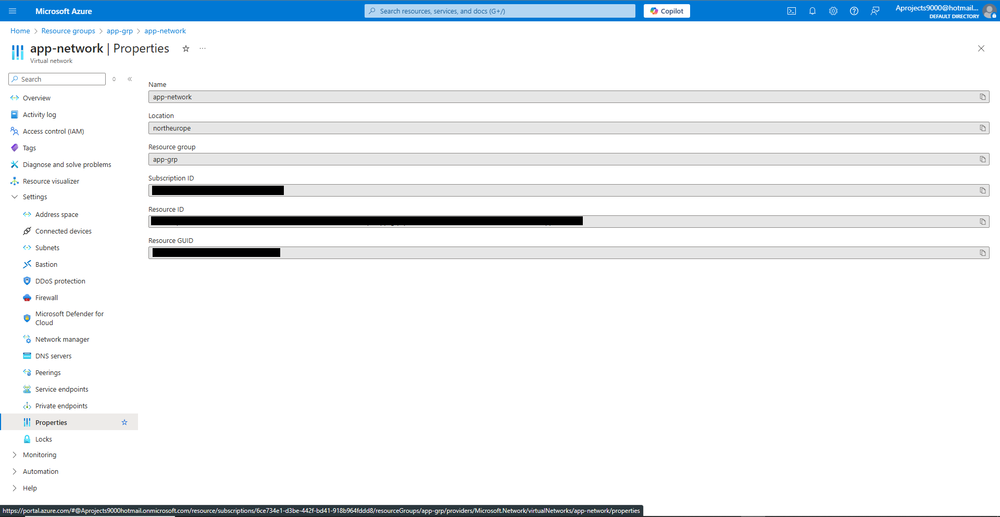

# Terraform - Azure - 14: Azure Infrastructure with Terraform - Quick note on accessing Azure resource properties
In this project I am going to learn to use Terraform in Azure. The reason for learning Terraform over ARM templates (or Bicep) is that Terraform can be used on other cloud platforms such as AWS and Google Cloud. I am following along with the [Azure Infrastructure with Terraform](https://www.youtube.com/playlist?list=PLLc2nQDXYMHowSZ4Lkq2jnZ0gsJL3ArAw) playlist from Alan Rodrigues. Thanks Alan.

## Project Table of Contents
- [Part 1: Azure Infrastructure with Terraform - What and Why Terraform](Part-1-Azure-Infrastructure-With-Terraform-What-and-Why-Terraform.md)
- [Part 2: Azure Infrastructure with Terraform - Concepts when it comes to Terraform](Part-2-Azure-Infrastructure-with-Terraform-Concepts-when-it-comes-to-Terraform.md)
- [Part 3: Azure Infrastructure with Terraform - Terraform workflow](Part-3-Azure-Infrastructure-with-Terraform-Terraform-workflow.md)
- [Part 4: Azure Infrastructure with Terraform - Installing Terraform](Part-4-Azure-Infrastructure-with-Terraform-Installing-Terraform.md)
- [Part 5: Azure Infrastructure with Terraform - Creating a resource group](Part-5-Azure-Infrastructure-with-Terraform-Creating-a-resource-group.md)
- [Part 6: Azure Infrastructure with Terraform - Creating an Azure Storage Account](Part-6-Azure-Infrastructure-with-Terraform-Creating-an-Azure-Storage-Account.md)
- [Part 7: Azure Infrastructure with Terraform - Terraform state](Part-7-Azure-Infrastructure-with-Terraform-Terraform-state.md)
- [Part 8: Azure Infrastructure with Terraform - Creating a container and a blob](Part-8-Azure-Infrastructure-with-Terraform-Creating-a-container-and-a-blob.md)
- [Part 9: Azure Infrastructure with Terraform - Dependencies between resources](Part-9-Azure-Infrastructure-with-Terraform-Dependencies-between-resources.md)
- [Part 10: Azure Infrastructure with Terraform - Destroying the resources](Part-10-Azure-Infrastructure-with-Terraform-Destroying-the-resources.md)
- [Part 11: Azure Infrastructure with Terraform - Using Variables](Part-11-Azure-Infrastructure-with-Terraform-Using-Variables.md)
- [Part 12: Azure Infrastructure with Terraform - Lab - Creating an Azure virtual network](Part-12-Azure-Infrastructure-with-Terraform-Lab-Creating-an-Azure-virtual-network.md)
- [Part 13: Azure Infrastructure with Terraform - Lab - Creating an Azure virtual machine](Part-13-Azure-Infrastructure-with-Terraform-Lab-Creating-an-Azure-virtual-machine.md)
- [Part 14: Azure Infrastructure with Terraform - Quick note on accessing Azure resource properties](Part-14-Azure-Infrastructure-with-Terraform-Quick-note-on-accessing-Azure-resource-properties.md)

## Part 1 Table of Contents

- [Intro](#intro)
- [Result](#result)


# Project

<a id="intro"></a>

## Intro

In this video we'll delve a little deeper into Azure resource properties

<a id="result"></a>

## Result

## [Part 14: Azure Infrastructure with Terraform - Quick note on accessing Azure resource properties](https://www.youtube.com/watch?v=zHWHBJ0JGxg&list=PLLc2nQDXYMHowSZ4Lkq2jnZ0gsJL3ArAw&index=14)

When we created a data block in part 13 to fetch the subnet id, we created a way to access a resource property. 

If you go onto the portal and into your network settings you'll find the properties:



Here you'll find things like the name and location. These are the properties we can access with our Terraform config file. Let's take our virtual network resource: 

```
resource "azurerm_virtual_network" "app_network" {
  name                = "app-network"
  location            = local.location
  resource_group_name = azurerm_resource_group.app_grp.name
  address_space       = ["10.0.0.0/16"]
```

Here we're creating properties or referencing properties via the use of arguments. As you can see in image 14.1, The 'name' property is found at the top. 

The data block we created earlier can be used to access properties of resources on the Azure platform. There's also something called "attributes." These can be used to access properties within a Terraform config file. The difference between a data block and attributes is that a data block can fetch properties from resources outside of the Terraform config file the data block resides in. Attributes only work for properties within the Terraform config file. 


&nbsp;
&nbsp;
-


