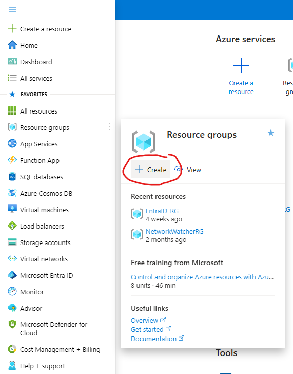
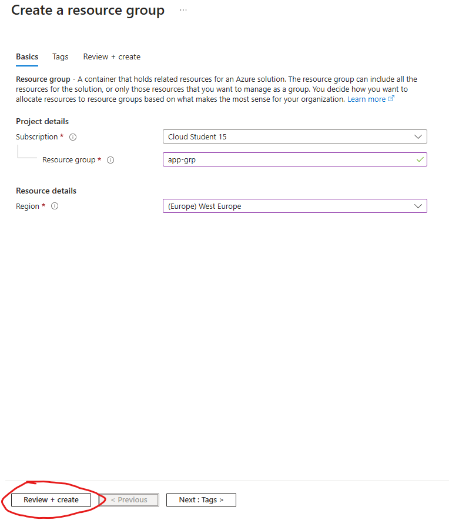
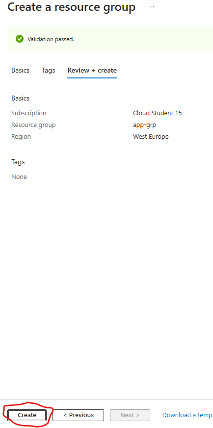
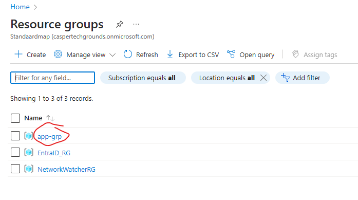
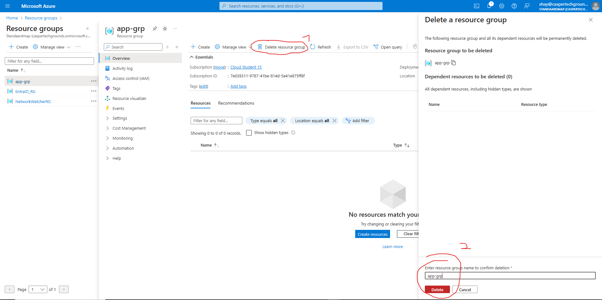

# [Terraform - Azure]
In this project I am going to learn to use Terraform in Azure. The reason for learning Terraform over ARM templates (or Bicep) is that the skills I will learn will be transferable to other cloud platforms such as AWS and Google Cloud.

# Table of Contents
1.  [Part 1: Azure Infrastructure with Terraform - What and Why Terraform](#part1)
2.  [Part 2: Azure Infrastructure with Terraform - Concepts when it comes to Terraform](#part2)
3.  [Part 3: Azure Infrastructure with Terraform - Terraform workflow](#part3)
4.  [Part 4: Azure Infrastructure with Terraform - Installing Terraform](#part4)
5.  [Part 5: Azure Infrastructure with Terraform - Creating a resource group](#part5)


## Key-terms
**Terraform:**  Terraform is an opensource tool used for provisioning and managing cloud infrastructure. By using IaC (Infrastructure as Code) you can simplify the deployment of resources by automating the process instead of having to create all your resources by hand.

**IaC (Infrastructure as Code):**

**ARM templates:** ARM templates offer the same service as Terraform, the difference being it is native to Microsoft Azure. 

**Terraform configuration file:** This tells Terraform how to manage the infrastructure.

**Blocks:** These are used to represent the configuration of an object. They are found within the Terraform configuration file.

**Resource block:** This is a block used to represent the infrastructure you want to deploy. This will contain the resource type, the name, and the location. The resource type and the name become the resource identifier in the format of ```resource_type.resource_name```. The name and location are arguments within the resource block.

**Provider:** These allow Terraform to work with external providors like Azure, or AWS.

**Azure Active Directory (Now called Microsoft Entra ID):** The Azure Active Directory is your Multicloud identity and access management provider. Through it you can manage who has access to your apps and resources in the cloud. It can also be used to manage your on-premises environment. This is done by creating user identities.


## Assignment
### Used sources
[1. The Azure Infrastructure with Terraform project of Alan Rodrigues](https://www.youtube.com/playlist?list=PLLc2nQDXYMHowSZ4Lkq2jnZ0gsJL3ArAw)

[2. How to create a table of contents](https://stackoverflow.com/questions/11948245/markdown-to-create-pages-and-table-of-contents)

[3. What is Azure Active Directory (Now called Microsoft Entra ID)?](https://www.microsoft.com/en-us/security/business/identity-access/microsoft-entra-id)


# Result
I am following along with the tutorials from Alan Rodrigues. I will make notes as I follow along. If a video has no notes, it sufficed to add the information to the key terms.

<br/>

<a id="part1"></a>
## [Part 1: Azure Infrastructure with Terraform - What and Why Terraform](https://www.youtube.com/watch?v=lH3KT9RUEOA&list=PLLc2nQDXYMHowSZ4Lkq2jnZ0gsJL3ArAw&index=1) 


Here Alan explains the what and the why of Terraform. 

Terraform is an open-source tool that is used for provisioning and managing cloud infrastructure. 

When you create a set of resources, for example; an Azure vnet with subnet and VMs, an Azure SQL database and Storage account, you have to deploy these all by hand. By submitting a Terraform config file, configured for the afore mentioned resources, to the Terraform executable, all will be done automatically. 

One example where you would use this automation is a test environment for an application. You can deploy the necessary resources for the test environment in one go, and once you've gone through the tests and you want to delete everything, you can do so in one go also. This significantly reduces time spent on deploying all resources for the resources listed in the previous paragraph. Mind you, that list is one of the simplest environments you will come across. So the potential to save time only increases from there. 

The way it works is through IaC (Infrastructure as Code). you build the code in a matter of minutes. you do this within the Terraform configuration file. This code then tells Azure, through the Terraform interface, what resources to deploy.

An advantage of Terraform is that it works with multiple cloud platforms. Platforms like Azure, AWS, and Google Cloud. This makes the knowledge of Terraform transferable to other cloud platforms. When using Azure, you can also use ARM templates to achieve the same as Terraform. The downside of this is that ARM templates is only appliccable to Azure. How Terraform is able to work with other platforms is through providors. For example, Azure will use an Azure providor, etc. etc.

<br/>
<br/>
<br/>

<a id="part2"></a>
## [Part 2: Azure Infrastructure with Terraform - Concepts when it comes to Terraform](https://www.youtube.com/watch?v=ov2of5ZCQgU&list=PLLc2nQDXYMHowSZ4Lkq2jnZ0gsJL3ArAw&index=2)

The code that will be used is defined in a Terraform configuration file. This file tells Terraform how to manage the infrastructure. In this file, blocks of code are held. These blocks are used to represent the configuration of an object. An example is given by way of a resource block:

```
resource "azurerm_resource_group" "app-grp"{
    name="app-grp"
    location="North Europe"
}
```
The resource block is used to represent the infrastructure you want to deploy. It will contain the resource type ```"azurem_resource_group"```and name ```"app-grp"```.

The resource type and name will become the resource identifier in the form of ```resource_type.resource_name```. 

The name ```name=äpp-grp"``` and location ```location="North Europe"``` are arguments within the resource block. This is to ensure th right property values are in place when defining the resource. You decide these arguments depending on the resource needs.

Finally you have the providors. These allow Terraform to work with external providors such as Azure or AWS. For Azure you would use an Azure providor, and for AWS an AWS providor. 

<br/>
<br/>
<br/>

<a id="part3"></a>
## [Part 3: Azure Infrastructure with Terraform - Terraform workflow](https://www.youtube.com/watch?v=Puw5zDFgZI0&list=PLLc2nQDXYMHowSZ4Lkq2jnZ0gsJL3ArAw&index=3)

In this video Alan describes the Terraform workflow. It is a 4 step workflow that goes as follows:

First there are some steps that come before the workflow steps. I'll list them below

-   The first step consists is creating a Terraform config file. Here you mention the resources that need to be deployed. 
-   You also need to make sure to actually have Terraform installed. This step will come in the next video. Now comes the first step in the workflow:

1.  Perform the Terraform init command. When you do this you initialise the working directory that contains the Terraform configuration files.
2.  Now you perform the Terraform plan command. An execution plan will be created that will define the changes Terraform will make to your infrastructure. This will be based on the config file.
3.  This is where you perform the Terraform apply command. The actions in the Terraform plan will be executed.
4.  If you want to destroy your infrastructure, this is where the Terraform destroy command comes in. All infrastructure objects created through the config file will now be destroyed. 

<br/>
<br/>
<br/>

<a id="part4"></a>
## [Part 4: Azure Infrastructure with Terraform - Installing Terraform](https://www.youtube.com/watch?v=8I12jCmvz-0&list=PLLc2nQDXYMHowSZ4Lkq2jnZ0gsJL3ArAw&index=4)

This is a follow along to download and install Terraform. Want to follow along? Click on the title link.

The steps are as follows:

1. Download the correct Terraform .exe file from [here](https://developer.hashicorp.com/terraform/install). 
2. Set up a new app directory (or use an existing one. I chose to make a new one just because I haven't done this before) in a location of your choice. I chose to make an app directory on my D:\ partition. 
3. In case of a new app directory, add the directory to the path variable. 
4. Unpack the Terraform.zip file in the new directory.
5. Place the unpacked Terraform.exe file from the unpacked map to the (new) app directory.
5. Download, install & or open VSCode. I have it installed so will skip the download and install process.
6. Create a tmp directory on a partition of your choice where the configuration files will be stored.
7. Open a folder in VSCode, under the file menu, and choose the tmp directory. 
8. Go to the extension marketplace, found on the left hand side in VSCode, and download HashiCorp Terraform to extend the functionality of VSCode. Also download Azure Terraform, as this will help to work with Azure from Terraform.
9. Create a new file and choose the Terraform language. (In the video he makes a new text file and from there chooses a language. When I make a new file I cannot find the Terraform language.)
10. Save the file to a name of your choice. I followed along and called it 'main'.
11. The Terraform configuration file has been set up and is ready to be made into a usable configuration file.

In the following video we'll continue building the configuration file. 

<br/>
<br/>
<br/>

<a id="part5"></a>
## [Part 5: Azure Infrastructure with Terraform - Creating a resource group](https://www.youtube.com/watch?v=wB52Rd5N9IQ&list=PLLc2nQDXYMHowSZ4Lkq2jnZ0gsJL3ArAw&index=5)


In this video Alan will show the process of deploying a resource group through the Azure Portal, and afterwards he is going to show the process through Terraform. I will follow along and add printscreens of the process. 

To create resources, you need a subscription and a resource group. The subscription is for billing purposes, and the resource group is for a logical grouping of the resources. There are four levels to management that are, from high to low:

- Management groups
- Subscriptions
- Resource groups
- Resources

### **Creating a resource group in the Azure Portal:**

1. Click on the create button of the Resource groups sub menu.  
    
2. Choose your subscription, name your resource group, and choose a region. Then skip the Tags menu by clicking on Review + create (As highlighted in red).  
    
3. Create your resource group.  
    
4. Delete your resource group. This is done by clicking on the resource group menu on the left hand side as is seen in step 1.   
      
    
   
After this you click on 'delete resource,' as is seen in the first circle. Then you fill in the resource name and click on the delete button, as is seen in the second circle. After this a confirmation window will pop up where you click on delete again.

### **Creating a resource group in Terraform:**

1. Go to the [Terraform documentation for the Azure Provider](https://registry.terraform.io/providers/hashicorp/azurerm/latest/docs) where you will find all the necessary statements - in the Terraform language - needed to work with a particular service on Azure. For other platforms like AWS, there is a similar documentation to provide the necessary statements to work within the respective provider.   

    It is important to be aware of the providor version you are using, in this case the Azure providor. A lot of updates happen within Azure, so the providor is constantly updated to accomodate these changes and additions to Azure.
2. The first important step in the definition of our first configuration file is authentication. Terraform needs the right credentials to get the same priviliges for creating resources as your Azure account has. This should be done without giving all your Azure account details to Terraform, since that would increase the chance of a security breach. A seperate set of credentials needs to be created for Terraform so that it can be authenticated and get the necessary priviliges on the Azure platform. For this, we will create an Application Object in Azure Active Directory. It is similar to a user identity in that it creates a digital identity within Micrsodoft Entra ID. 

    **Creating an Application Object:**

    1.  Go to the "Microsoft Entra ID" menu item and click on it. 
    2.  Open the "Manage" option and click on "App registration."
    3.  Click on "New registration."
    4.  Create a display name. Leave the rest as it is, and click on register.   

    An identity has now been defined which can be used by our Terraform configuration file.

3.  **Creating a resource group with Terraform**  
    1.  we go back to the [Terraform documentation for the Azure Provider, or azurerm modules.](https://registry.terraform.io/providers/hashicorp/azurerm/latest/docs). Here you can click on the provider button, and then copy the code that appears.
    2.  Now we paste the code into the Terraform configuration file (main.tf) we've created before in [part 4](#part4). This is the starting point for using the Azure Resource Manager (azurerm) provider by Terraform.  
        1. The first part of the code: 
        ```
        terraform {
            required_providers {
                azurerm = {
                    source = "hashicorp/azurerm"
                    version = "3.113.0"
                }
            }
        }
        ```


