# Terraform - Azure - Part 6: Azure Infrastructure with Terraform - Creating an Azure Storage Account
In this project I am going to learn to use Terraform in Azure. The reason for learning Terraform over ARM templates (or Bicep) is that Terraform can be used on other cloud platforms such as AWS and Google Cloud. I am following along with the [Azure Infrastructure with Terraform](https://www.youtube.com/playlist?list=PLLc2nQDXYMHowSZ4Lkq2jnZ0gsJL3ArAw) playlist from Alan Rodrigues. Thanks Alan!

## Project Table of Contents
- [Part 1: Azure Infrastructure with Terraform - What and Why Terraform](Part-01-Azure-Infrastructure-With-Terraform-What-and-Why-Terraform.md)
- [Part 2: Azure Infrastructure with Terraform - Concepts when it comes to Terraform](Part-02-Azure-Infrastructure-with-Terraform-Concepts-when-it-comes-to-Terraform.md)
- [Part 3: Azure Infrastructure with Terraform - Terraform workflow](Part-03-Azure-Infrastructure-with-Terraform-Terraform-workflow.md)
- [Part 4: Azure Infrastructure with Terraform - Installing Terraform](Part-04-Azure-Infrastructure-with-Terraform-Installing-Terraform.md)
- [Part 5: Azure Infrastructure with Terraform - Creating a resource group](Part-05-Azure-Infrastructure-with-Terraform-Creating-a-resource-group.md)
- [Part 6: Azure Infrastructure with Terraform - Creating an Azure Storage Account](Part-06-Azure-Infrastructure-with-Terraform-Creating-an-Azure-Storage-Account.md)
- [Part 7: Azure Infrastructure with Terraform - Terraform state](Part-07-Azure-Infrastructure-with-Terraform-Terraform-state.md)
- [Part 8: Azure Infrastructure with Terraform - Creating a container and a blob](Part-08-Azure-Infrastructure-with-Terraform-Creating-a-container-and-a-blob.md)
- [Part 9: Azure Infrastructure with Terraform - Dependencies between resources](Part-09-Azure-Infrastructure-with-Terraform-Dependencies-between-resources.md)
- [Part 10: Azure Infrastructure with Terraform - Destroying the resources](Part-10-Azure-Infrastructure-with-Terraform-Destroying-the-resources.md)
- [Part 11: Azure Infrastructure with Terraform - Using Variables](Part-11-Azure-Infrastructure-with-Terraform-Using-Variables.md)
- [Part 12: Azure Infrastructure with Terraform - Lab - Creating an Azure virtual network](Part-12-Azure-Infrastructure-with-Terraform-Lab-Creating-an-Azure-virtual-network.md)
- [Part 13: Azure Infrastructure with Terraform - Lab - Creating an Azure virtual machine](Part-13-Azure-Infrastructure-with-Terraform-Lab-Creating-an-Azure-virtual-machine.md)
- [Part 14: Azure Infrastructure with Terraform - Quick note on accessing Azure resource properties](Part-14-Azure-Infrastructure-with-Terraform-Quick-note-on-accessing-Azure-resource-properties.md)

## Part 1 Table of Contents

- [Intro](#intro)
- [Result](#result)


# Project

<a id="intro"></a>

## Intro

In this video we'll be making an Azure storage manually and through Terraform.

<a id="result"></a>

## Result

## [Part 6: Azure Infrastructure with Terraform - Creating an Azure Storage Account](https://www.youtube.com/watch?v=3Dw20Ajgg_s&list=PLLc2nQDXYMHowSZ4Lkq2jnZ0gsJL3ArAw&index=13) 

We'll build onto our previously created main.tf file. In the video, Alan continues as if the resource group still exists. In my notes I said to delete your resources at the end. This is the best practice since it's good to delete anything you aren't using. A resource group and storage account doesn't cost money, but data stored within does. So at the end of each video I delete all the resources I've created. There's the added benefit of extra practice through repeating the subject matter of previous exercises.

### Creating a Storage Account Manually

There are multiple ways to go about creating a storage account within the Azure portal. We'll follow the video's example. Click on the menu icon top left (1), then click on the storage account option (2), finally click on the 'create' button (3).  
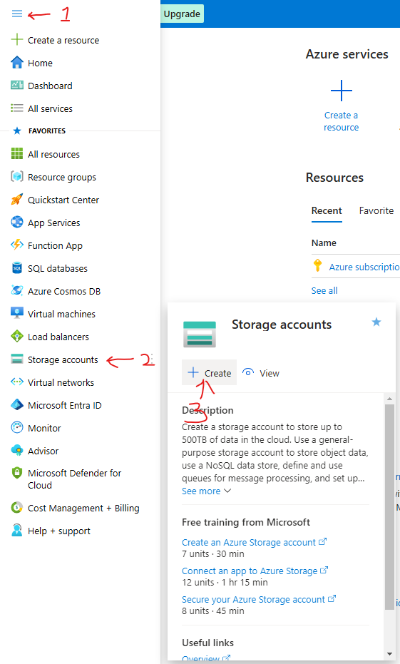


You can now click on either circled buttons.  
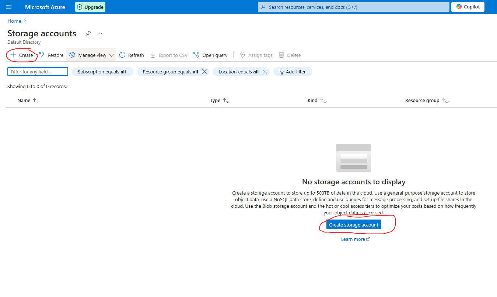

From here, you have to fill in. some things that I'll list:  
1. Your subscription should be chosen already  
2. Since we've deleted the resource group at the end of the last video, we have to create a new one. Simply click on the 'create new' button and choose a name. I chose the same name as of the last video.  
3. Create a unique (not just locally, but accross the whole Azure platform) name for your storage account.   
4. Select a region that works for you. For the sake of this exercise it doesn't matter much.  
5. Leave this option open.  
6. Leave this on standard, since it's a cheaper option.  
7. Choose Locally-redundant storage (LRS) since this is the cheapest redundancy option. 

Before you go to step 8, have a look around the other menu's and their features without changing anything. Just to get yourself a little more familiar with them.

8. Now go to review + create and then click on 'create' on the following page.

Your resource is deployed!     
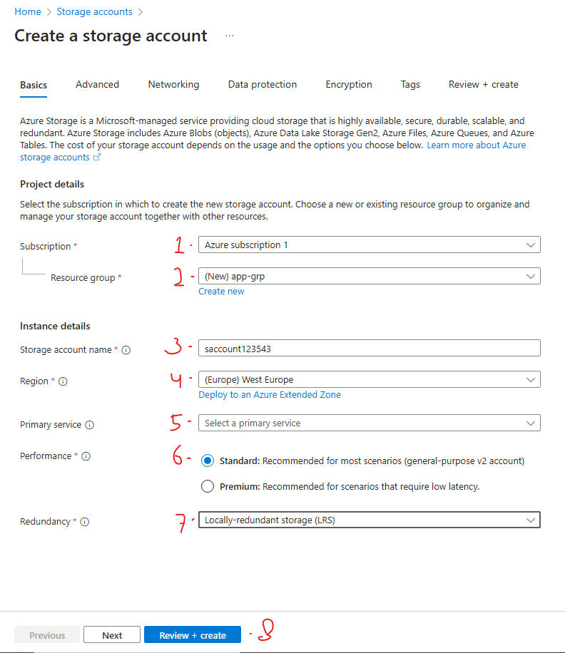  
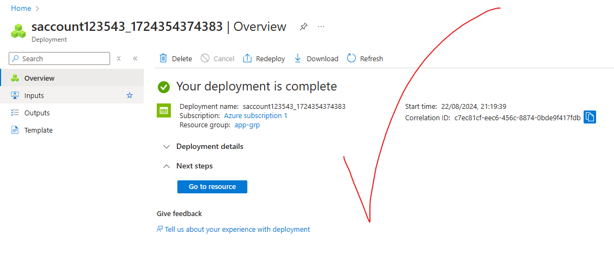
&nbsp;  
&nbsp;  


There are 5 important aspects that need to be configured for the storage account:

1. [Resource group](https://learn.microsoft.com/en-us/azure/azure-resource-manager/management/manage-resource-groups-portal#what-is-a-resource-group) (A group created to store resources in one place. This is to keep your resources organised and to help with workflow)
2. [Region](https://azure.microsoft.com/en-gb/explore/global-infrastructure/geographies) (The primary location (region) where your storage account data will be stored)
3. Name (The name of the storage account)
4. Performance (Most notably, if you want to use HDD (Standard) or SSD (Premium) performance. With standard being more cost efficient, but premium offering a lower latency and higher throughput.)
5. Redundancy (The type of duplication of data you have for your storage account.)

Types of performance can be seen on [this page](https://learn.microsoft.com/en-us/azure/storage/common/storage-account-overview) under "type of storage account" in the first table. 
Types of redundancy can be seen on the same page under "redundancy options" of the same table.

With a storage account, there are four different types of data storage:

1. [Containers](https://azure.microsoft.com/en-in/resources/cloud-computing-dictionary/what-is-a-container#:~:text=Containers%20provide%20an%20easy%20way,such%20as%20Azure%20Blob%20storage.)
2. [File shares](https://learn.microsoft.com/en-us/azure/storage/files/storage-files-introduction)
3. [Queues](https://learn.microsoft.com/en-us/azure/storage/queues/storage-queues-introduction)
4. [Tables](https://learn.microsoft.com/en-us/azure/storage/tables/table-storage-overview)

### Creating a Storage Account Through Terraform

First we open our main.tf file. If you deleted your client secret like I have, follow the necessary steps in [part 5](Part-5-Azure-Infrastructure-with-Terraform-Creating-a-resource-group.md) to create a new one. You can always go back to previous parts if there's anything you've forgotten. 

Then we go to the [Terraform azurerm documentation page](https://registry.terraform.io/providers/hashicorp/azurerm/latest/docs) and from here we go to the storage account documentation (1) & (2). Now go ahead and copy the storage account block (3). We don't need the whole example code since we've already created the resource group code block in part 5.

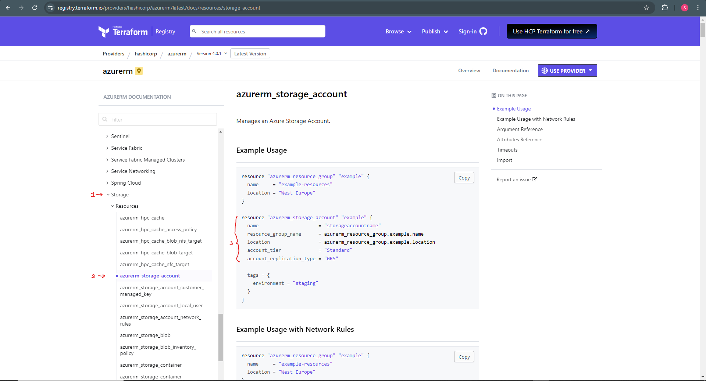

If you scroll further down the page, you'll find the argument reference list. This is a list of all the arguments you can add to your storage account resource block. These are arguments to add or change values for all the features of a storage account. You can find all these features in the Azure Portal while creating your storage account manually. If you remember, I invited you to have a look around while creating the storage account manually, before step 8. 

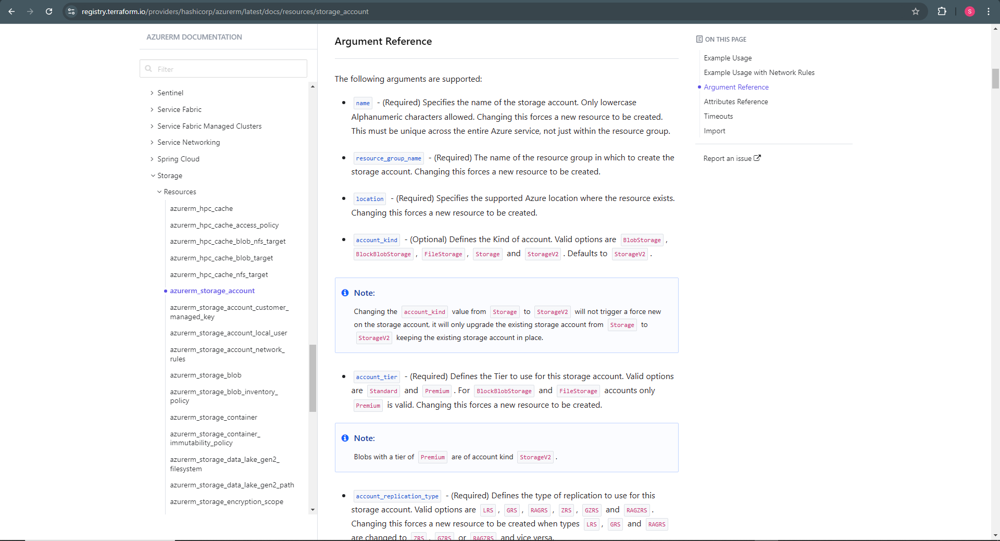

Now we'll add the code block to our existing main.tf file. In the video, Alan replaces the resource group resource block with the storage account resource block. He'll later go on to tell you to add it back in because of an error. Since we deleted our resources at the end of each part, we're going to keep the resource group resource block in from the start. 

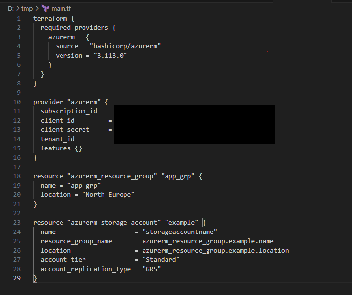

Let's look at the resource block:

```"azurerm_storage_account"```: This is the resource type.
```"name"```: The name for the resource block within Terraform.
```name                     = "storageaccountname"```: The name for the actual storage account. This name needs to be completely unique.
```resource_group_name      = azurerm_resource_group.example.name```: The name for the resource group where the storage account will be stored. In our case, use the name given in the resource group resource block. When a resource group already exists you give the name for that resource group.
```location                 = azurerm_resource_group.example.location```: The location of the storage account. We'll use the location of the video, which is ```North Europe```.
```account_tier             = "Standard"```: The account tier. We previously discussed the difference between standard and premium performance when setting up the storage account manually. This was in relation to the account tier, also called storage account type.
```account_replication_type = "GRS"```: The replication type. This was also previously discussed, and is in relation to the redundancy of the storage account data. It is now set to GRS (Geo-redundant storage), and you might still remember we set it to LRS (Locally-redudant storage) when setting up the storage account manually. 


Note: The values given in the example for the resource group name and location are referencing the values of the same example's resource group resource block. 

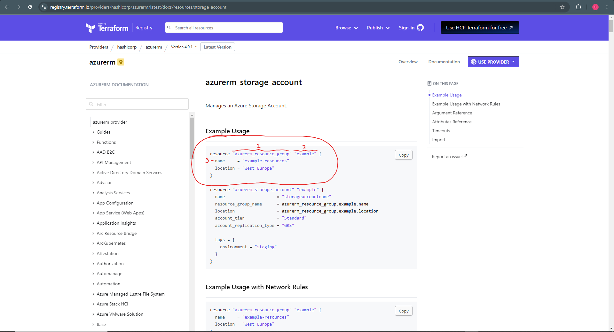

```resource_group_name      = azurerm_resource_group.example.name```:
```azurerm_resource_group``` (1) is referencing the type of resource
```example``` (2) is referencing the internal (Terraform) name for the resource block
```name``` (3) is referencing the name for the resource group within Azure. By stating "name" it will call the value given for the name argument within the resource group resource block.

This format is used when you want to reference a resource block within the same Terraform configuration file.

**Time to deploy**

Now it's time to deploy. Your main.tf file should look like so:

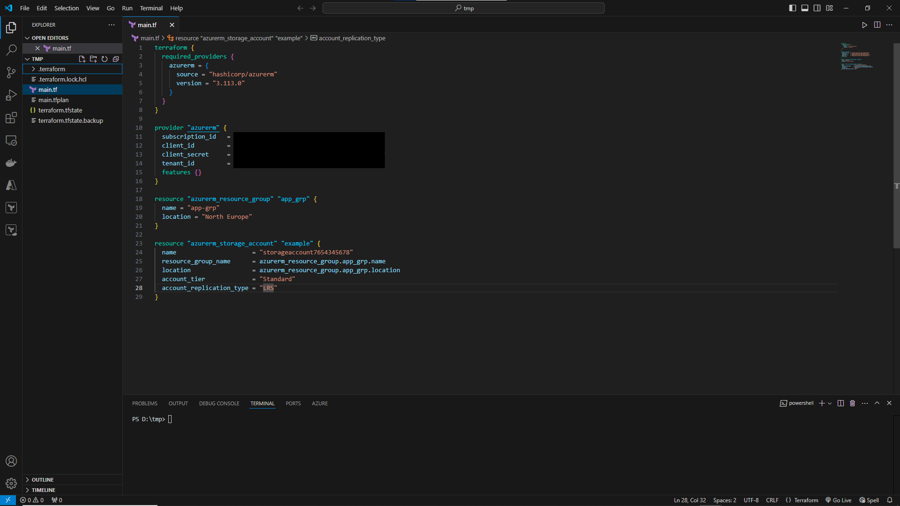

First things first, we'll initialise Terraform with ```terraform init```. This might not be necessary, but it does no harm and could be necessary. For example to get all your plugins and modules up to date.

From here we'll do the same as in Part 5, where we'll first create a plan with the command ```terraform plan -out main.tfplan```.

Since everything is deleted, the plan will state two resources will be created.

From here use the command ```terraform apply "main.tfplan"```

Your resources should be deployed and showing in the Azure Portal! Here is what the terminal process should look like from start to finish + Azure Portal result:

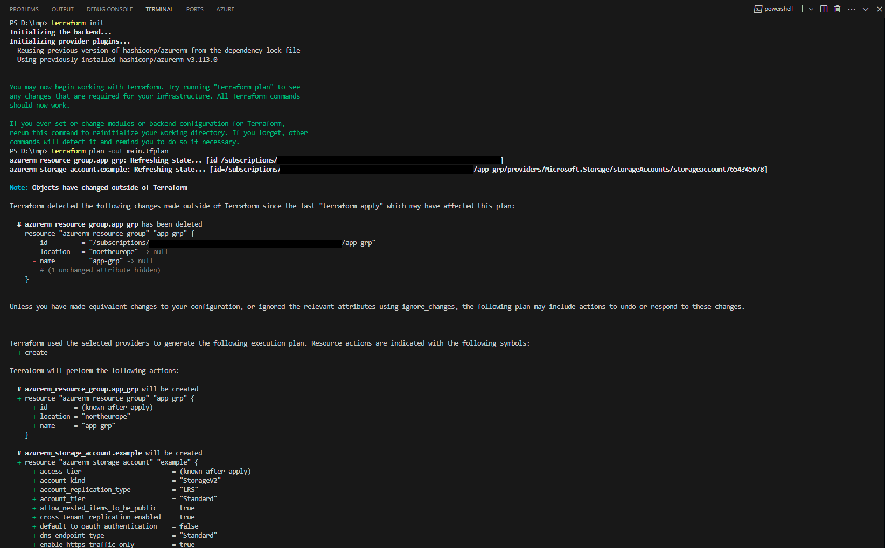
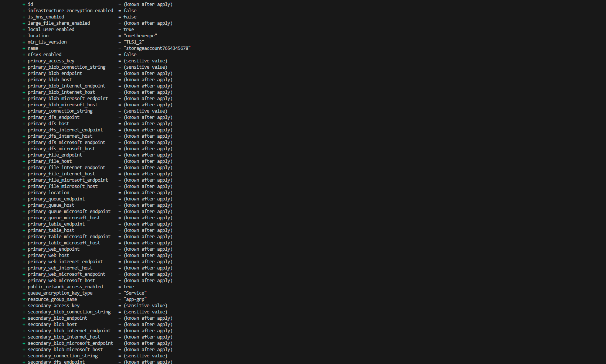
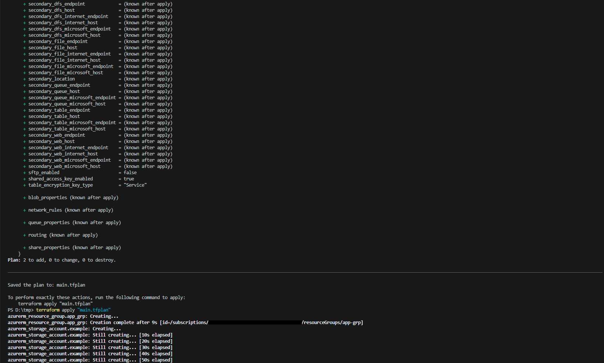
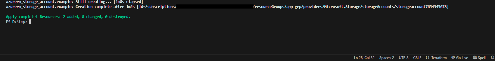
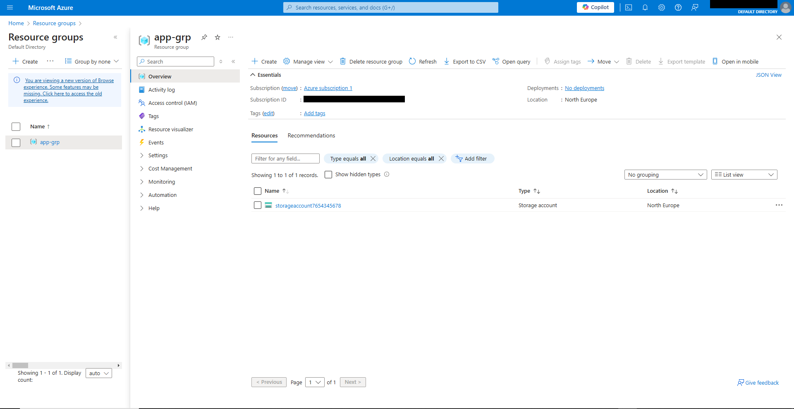

Note: You can use the up and down arrows to scroll through previously used commands in the terminal.


