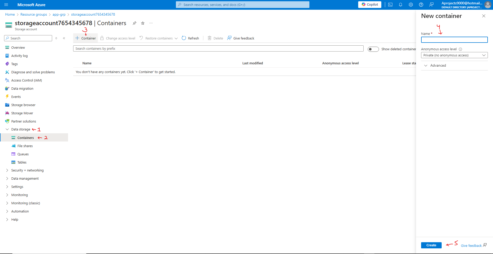
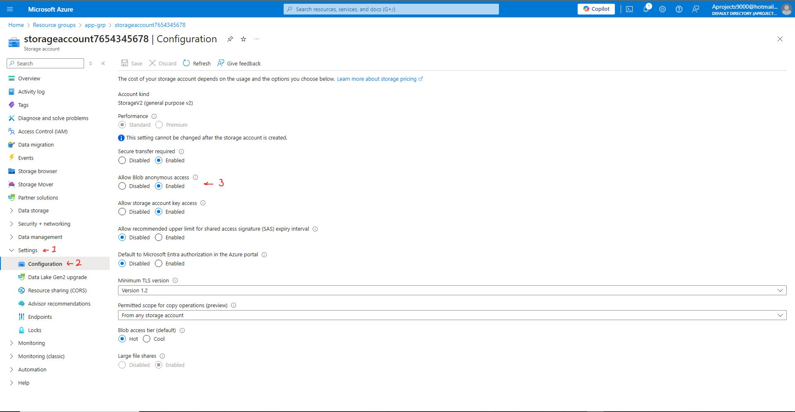
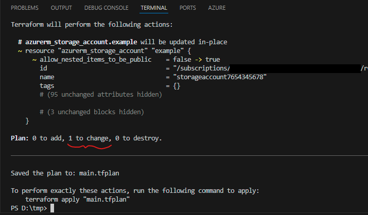
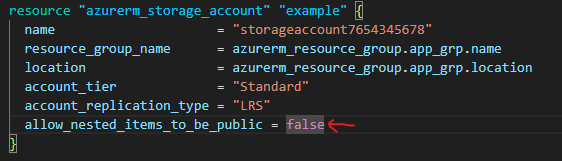
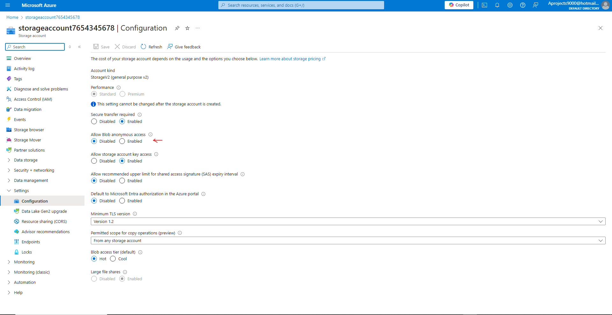

# Terraform - Azure - Part 7: Azure Infrastructure with Terraform - Terraform state
In this project I am going to learn to use Terraform in Azure. The reason for learning Terraform over ARM templates (or Bicep) is that Terraform can be used on other cloud platforms such as AWS and Google Cloud. I am following along with the [Azure Infrastructure with Terraform](https://www.youtube.com/playlist?list=PLLc2nQDXYMHowSZ4Lkq2jnZ0gsJL3ArAw) playlist from Alan Rodrigues. Thanks Alan!

## Project Table of Contents
- [Part 1: Azure Infrastructure with Terraform - What and Why Terraform](Part-01-Azure-Infrastructure-With-Terraform-What-and-Why-Terraform.md)
- [Part 2: Azure Infrastructure with Terraform - Concepts when it comes to Terraform](Part-02-Azure-Infrastructure-with-Terraform-Concepts-when-it-comes-to-Terraform.md)
- [Part 3: Azure Infrastructure with Terraform - Terraform workflow](Part-03-Azure-Infrastructure-with-Terraform-Terraform-workflow.md)
- [Part 4: Azure Infrastructure with Terraform - Installing Terraform](Part-04-Azure-Infrastructure-with-Terraform-Installing-Terraform.md)
- [Part 5: Azure Infrastructure with Terraform - Creating a resource group](Part-05-Azure-Infrastructure-with-Terraform-Creating-a-resource-group.md)
- [Part 6: Azure Infrastructure with Terraform - Creating an Azure Storage Account](Part-06-Azure-Infrastructure-with-Terraform-Creating-an-Azure-Storage-Account.md)
- [Part 7: Azure Infrastructure with Terraform - Terraform state](Part-07-Azure-Infrastructure-with-Terraform-Terraform-state.md)
- [Part 8: Azure Infrastructure with Terraform - Creating a container and a blob](Part-08-Azure-Infrastructure-with-Terraform-Creating-a-container-and-a-blob.md)
- [Part 9: Azure Infrastructure with Terraform - Dependencies between resources](Part-09-Azure-Infrastructure-with-Terraform-Dependencies-between-resources.md)
- [Part 10: Azure Infrastructure with Terraform - Destroying the resources](Part-10-Azure-Infrastructure-with-Terraform-Destroying-the-resources.md)
- [Part 11: Azure Infrastructure with Terraform - Using Variables](Part-11-Azure-Infrastructure-with-Terraform-Using-Variables.md)
- [Part 12: Azure Infrastructure with Terraform - Lab - Creating an Azure virtual network](Part-12-Azure-Infrastructure-with-Terraform-Lab-Creating-an-Azure-virtual-network.md)
- [Part 13: Azure Infrastructure with Terraform - Lab - Creating an Azure virtual machine](Part-13-Azure-Infrastructure-with-Terraform-Lab-Creating-an-Azure-virtual-machine.md)
- [Part 14: Azure Infrastructure with Terraform - Quick note on accessing Azure resource properties](Part-14-Azure-Infrastructure-with-Terraform-Quick-note-on-accessing-Azure-resource-properties.md)

## Part 7 Table of Contents

- [Intro](#intro)
- [Result](#result)

# Project

## Intro

In this video we're going to create a container in our Storage Account. We're also going to talk and go through an important difference between deploying a Storage Account through the Azure Portal, and through Terraform. This is that the "Allow blob public access" (Now called "Allow blob anonymous access") option is, by default, set to "enabled" when deploying a Storage Account through the Azure Portal, and "disabled" when deploying it through Terraform. We'll go through the steps for making sure our Terraform config file allows this from the start of deployment.

## Result

## [Part 7: Azure Infrastructure with Terraform - Terraform state](https://www.youtube.com/watch?v=_rrZgDx-kXg&list=PLLc2nQDXYMHowSZ4Lkq2jnZ0gsJL3ArAw&index=7) 

First we'll deploy our Storage Account through Terraform with the latest main.tf config file, since we've deleted all our resources at the end of the last part. Follow along with the previous MD file if you get stuck anywhere.

Then we're going to create a container on our Storage Account. From your Storage Account, Click on Data storage (1), and containers (2). From here click on + container (3). Now create a name for the container (4), this name doesn't have to be completely unique, just within your account. Then click create (5). 

The whole video is essentially pointless, as apparently Terraform now has the "public_network_access_enabled" option enabled by default when deploying a Storage Account. We'll go through the steps anyway, as it doesn't hurt to familiarise ourselves with the different values we can give resource blocks.

On your Storage Account page, if you go to Settings (1), then Configuration (2), you'll find the option "Allow blob anonymous access" (3). This is a new terminology for the old "Allow blob public access" option shown in Alan's video. As you can see it is already enabled, unlike in Alan's video. Terraform must have updated this. 

We'll turn the option "Allow blob anonymous access" to false instead of true as in the video.

Now go to your main.tf file and create a new plan. You'll see Terraform wants to apply 1 change. This is changing the "Allow blob anonymous access" option back to true.

Terraform remembers the state of your settings, and applies them everytime you apply the main plan. So if someone has changed any settings and you want to reset your whole configuration to it's baseline, you only have to apply your config file again. 

For the sake of practice, we'll add in the argument "allow_nested_items_to_be_public = false" instead of "... = true" to our storage account resource block so that Allow blob anonymous access defaults to false instead of true. 

When having added it, save the config file and then create a new plan and apply it. You'll find the plan to contain 1 change. After applying check to see if your "Allow blob anonymous access" option is disabled.

After you've done all this, remove the "allow_nested_items_to_be_public = false" argument from the Storage Account resource block and save the config file. 

Now remove all the resources from your Azure account. Another part done, congrats! 

##  

