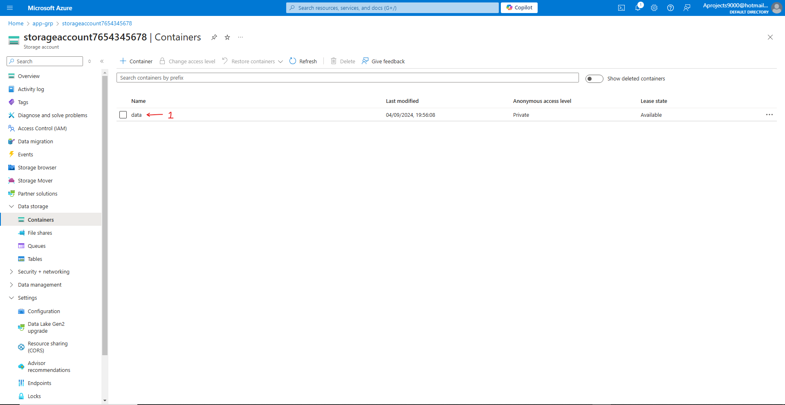
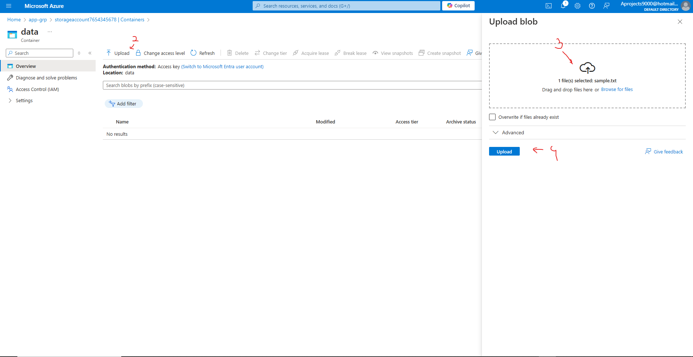
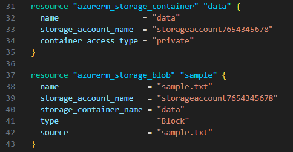

# Terraform - Azure - Part 1: Azure Infrastructure with Terraform - What and Why Terraform
In this project I am going to learn to use Terraform in Azure. The reason for learning Terraform over ARM templates (or Bicep) is that Terraform can be used on other cloud platforms such as AWS and Google Cloud. I am following along with the [Azure Infrastructure with Terraform](https://www.youtube.com/playlist?list=PLLc2nQDXYMHowSZ4Lkq2jnZ0gsJL3ArAw) playlist from Alan Rodrigues. Thanks Alan.

## Project Table of Contents
- [Part 1: Azure Infrastructure with Terraform - What and Why Terraform](Part-01-Azure-Infrastructure-With-Terraform-What-and-Why-Terraform.md)
- [Part 2: Azure Infrastructure with Terraform - Concepts when it comes to Terraform](Part-02-Azure-Infrastructure-with-Terraform-Concepts-when-it-comes-to-Terraform.md)
- [Part 3: Azure Infrastructure with Terraform - Terraform workflow](Part-03-Azure-Infrastructure-with-Terraform-Terraform-workflow.md)
- [Part 4: Azure Infrastructure with Terraform - Installing Terraform](Part-04-Azure-Infrastructure-with-Terraform-Installing-Terraform.md)
- [Part 5: Azure Infrastructure with Terraform - Creating a resource group](Part-05-Azure-Infrastructure-with-Terraform-Creating-a-resource-group.md)
- [Part 6: Azure Infrastructure with Terraform - Creating an Azure Storage Account](Part-06-Azure-Infrastructure-with-Terraform-Creating-an-Azure-Storage-Account.md)
- [Part 7: Azure Infrastructure with Terraform - Terraform state](Part-07-Azure-Infrastructure-with-Terraform-Terraform-state.md)
- [Part 8: Azure Infrastructure with Terraform - Creating a container and a blob](Part-08-Azure-Infrastructure-with-Terraform-Creating-a-container-and-a-blob.md)
- [Part 9: Azure Infrastructure with Terraform - Dependencies between resources](Part-09-Azure-Infrastructure-with-Terraform-Dependencies-between-resources.md)
- [Part 10: Azure Infrastructure with Terraform - Destroying the resources](Part-10-Azure-Infrastructure-with-Terraform-Destroying-the-resources.md)
- [Part 11: Azure Infrastructure with Terraform - Using Variables](Part-11-Azure-Infrastructure-with-Terraform-Using-Variables.md)
- [Part 12: Azure Infrastructure with Terraform - Lab - Creating an Azure virtual network](Part-12-Azure-Infrastructure-with-Terraform-Lab-Creating-an-Azure-virtual-network.md)
- [Part 13: Azure Infrastructure with Terraform - Lab - Creating an Azure virtual machine](Part-13-Azure-Infrastructure-with-Terraform-Lab-Creating-an-Azure-virtual-machine.md)
- [Part 14: Azure Infrastructure with Terraform - Quick note on accessing Azure resource properties](Part-14-Azure-Infrastructure-with-Terraform-Quick-note-on-accessing-Azure-resource-properties.md)

## Part 1 Table of Contents

- [Intro](#intro)
- [Result](#result)


# Project

<a id="intro"></a>

## Intro

In this video we're going to create a container, and add content to it through Terraform.


<a id="result"></a>

## Result

## [Part 8: Azure Infrastructure with Terraform - Creating a container and a blob](https://www.youtube.com/watch?v=IU1G7EgKGY8&list=PLLc2nQDXYMHowSZ4Lkq2jnZ0gsJL3ArAw&index=8) 

First things first, we'll go ahead and create our storage account through Terraform. You know the drill.

Then we'll create a container in the Azure portal, like we did in the last part. Go back if necessary. 

Now we'll create a sample .txt file in our app directory (the directry we created at the start of the project, and where our terraform application is stored). Right click while in the directory, go to "new" and "text document." Name the file "sample.txt". Open the file and add into it "This is a sample file." If you want to be really wild, you say "This is not a sample file." That'll show 'em.

Now go back to the portal and go to your new container (1). Upload (2) the sample.txt file (3)(4).




Have a little look around the file. When you're done you can delete the container, since we're going to add it through Terraform next!

**Creating a container and blob through Terraform**

We're going to need to add a resource block for the container and for the blob. We'll add this to our existing config (main.tf) file since we're building onto our configuration. 

On the [Terraform documentation page](https://registry.terraform.io/providers/hashicorp/azurerm/latest/docs), look for the necessary code for a storage container, and for a storage blob. Copy the code into your config file. The resource blocks should look like this:



I'll explain each part: 

```
resource "azurerm_storage_container" "data" {
  name                  = "data"  (The storage container name in Azure)
  storage_account_name  = "storageaccount7654345678" (The storage account name where the container will sit in Azure)
  container_access_type = "private" (The access level)
}

resource "azurerm_storage_blob" "sample" {
  name                   = "sample.txt" (Your storage blob name in Azure)
  storage_account_name   = "storageaccount7654345678" (Your storage account name in Azure)
  storage_container_name = "data" (Your storage container name in Azure)
  type                   = "Block" (The blob type)
  source                 = "sample.txt" (The name of the local file you're uploading)
}
```

To be able to upload a local file, we'll have to copy the sample.txt file into our tmp directory. Go ahead and do this.

Now we'll go ahead and save the changes, then create a new plan and deploy our new resources!

Each blob is accessible through the web. Click on your blob object. In the overview you'll find the url. Copy it and go there. You'll find you're unable to go there. This is because we've set our access level to private. We can change this by changing the access level to "blob" in our container resource block. What this does is allow anonymous read access to blobs only. If we were to change it to container, it would allow anonymous read access to both blobs and containers. So, our containter_access_type argument in our container resource block will look like this: ```container_access_type = "blob"```. Deploy your plan and see if it worked! It should now download your .txt file.

To see for yourself what the possible values are for the container_access_type argument, go to the documentation page for the storage container resource.

That's it for this part. If you're not continuing, don't forget to delete your resources!


**Problems**
I stumbled upon the problem of my storage account being destroyed and a new one being deployed in the plan. I didn't understand why until I had a look through the plan and realised I had changed the resource block name for the storage account resource. So the resource didn't match the current configuration anymore. I changed the storage account resource block name back to the old name for this video, and changed it at the end. The problem won't arise anymore since I delete all resources at the end of each part. Why I changed the name in the first place is because I had kept the example name from the Terraform documentation page, and wanted to clean this up to match the resource block name with the resource name in Azure. 

I set up the resources again at the start of the day, and noticed I can't deploy all resources in one go. I can do it in two goes, first the resource group and storage account, and then the container and blob. If I try to do them all in one go, the previously created resources can't be found if their names are stated simpy as a string. In the example of the blob resource, referring to the container name with ```"data"``` doesn't work. It does work if I refer to the name with ```azurerm_storage_container.data.name```

I want to see if there's any difference in making a string value of the plan name when deploying it, like so ```terraform apply "main.tfplan". Probably not, but that's something I do differently from Alan. Worth a try.
Nope, no difference. It cannot find the storage account for some reason. So, if deploying everything in one go, refer to resources with the proper terraform identification i.e. ```resource_type.internal_resource_name.name```. I do find this interesting since in the created plan, both ways it states the storage account name the same way for the container and blob resource deployment. 

## []() 


