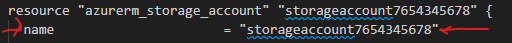
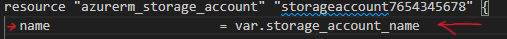
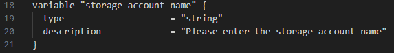
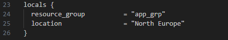

# Terraform - Azure - Part 11: Azure Infrastructure with Terraform - Using Variables
In this project I am going to learn to use Terraform in Azure. The reason for learning Terraform over ARM templates (or Bicep) is that Terraform can be used on other cloud platforms such as AWS and Google Cloud. I am following along with the [Azure Infrastructure with Terraform](https://www.youtube.com/playlist?list=PLLc2nQDXYMHowSZ4Lkq2jnZ0gsJL3ArAw) playlist from Alan Rodrigues. Thanks Alan.

## Project Table of Contents
## Project Table of Contents
- [Part 1: Azure Infrastructure with Terraform - What and Why Terraform](Part-01-Azure-Infrastructure-With-Terraform-What-and-Why-Terraform.md)
- [Part 2: Azure Infrastructure with Terraform - Concepts when it comes to Terraform](Part-02-Azure-Infrastructure-with-Terraform-Concepts-when-it-comes-to-Terraform.md)
- [Part 3: Azure Infrastructure with Terraform - Terraform workflow](Part-03-Azure-Infrastructure-with-Terraform-Terraform-workflow.md)
- [Part 4: Azure Infrastructure with Terraform - Installing Terraform](Part-04-Azure-Infrastructure-with-Terraform-Installing-Terraform.md)
- [Part 5: Azure Infrastructure with Terraform - Creating a resource group](Part-05-Azure-Infrastructure-with-Terraform-Creating-a-resource-group.md)
- [Part 6: Azure Infrastructure with Terraform - Creating an Azure Storage Account](Part-06-Azure-Infrastructure-with-Terraform-Creating-an-Azure-Storage-Account.md)
- [Part 7: Azure Infrastructure with Terraform - Terraform state](Part-07-Azure-Infrastructure-with-Terraform-Terraform-state.md)
- [Part 8: Azure Infrastructure with Terraform - Creating a container and a blob](Part-08-Azure-Infrastructure-with-Terraform-Creating-a-container-and-a-blob.md)
- [Part 9: Azure Infrastructure with Terraform - Dependencies between resources](Part-09-Azure-Infrastructure-with-Terraform-Dependencies-between-resources.md)
- [Part 10: Azure Infrastructure with Terraform - Destroying the resources](Part-10-Azure-Infrastructure-with-Terraform-Destroying-the-resources.md)
- [Part 11: Azure Infrastructure with Terraform - Using Variables](Part-11-Azure-Infrastructure-with-Terraform-Using-Variables.md)
- [Part 12: Azure Infrastructure with Terraform - Lab - Creating an Azure virtual network](Part-12-Azure-Infrastructure-with-Terraform-Lab-Creating-an-Azure-virtual-network.md)
- [Part 13: Azure Infrastructure with Terraform - Lab - Creating an Azure virtual machine](Part-13-Azure-Infrastructure-with-Terraform-Lab-Creating-an-Azure-virtual-machine.md)
- [Part 14: Azure Infrastructure with Terraform - Quick note on accessing Azure resource properties](Part-14-Azure-Infrastructure-with-Terraform-Quick-note-on-accessing-Azure-resource-properties.md)

## Part 1 Table of Contents

- [Intro](#intro)
- [Result](#result)


# Project

<a id="intro"></a>

## Intro

In this video we're going through the process of creating variables and locals. Variables are used to store information which later on can be called upon. Locals are local variables, only used within the Terraform configuration file. 

<a id="result"></a>

## Result

## [Part 11: Azure Infrastructure with Terraform - Using Variables](https://www.youtube.com/watch?v=2LG9p12_EHw&list=PLLc2nQDXYMHowSZ4Lkq2jnZ0gsJL3ArAw&index=11)

when creating resources you have to enter in your values, such as a name, location, etc. These values can be hardcoded into the resource like so: 



They can also be added through variables. By adding a variable, this variable can later be called upon like so: 



### Creating Variables

Let's make the variable that's referred to in the above image. You can copy my example below. I've chosen to place it under the provider block since Alan does so too. It shouldn't make too much difference where you place it, although placing it at the top will keep things more organised. When you're done it will look similar to any other block in your file: 



When it comes to the types of variables, there are a few. For now we'll keep to the ```string``` variable. This is a variable that contains a 'string' of text. This means that if the variable is called upon elsewhere, it will always be interpreted as a string of text. 

Now we'll go over our main file and specify the variable wherever there is a storage account name. By this I mean that we're going to "call upon" the variable as shown in the second image of this part. 

**Deploying the file**

First create your plan with the command "terraform plan -out main.tfplan"
You will be prompted to give a storage account name per the variable we've created.  
Now apply the plan: "terraform apply "main.tfplan""
In Alan's video he gets an error while deploying because there's a resource group dependency missing in the storage account, but since we've added this dependency in a previous part already, this error should not occur. If it does, go ahead and add a dependency in the storage account for the resource group. 


### Creating Locals

Next we will create a local. This works almost the same as a variable. The difference being that with a variable you can have the file interact with the interface, as we've done with our previous variable. A local will only work within the file. The local will look as follows:



Now we've created an internal variable that we can refer to when we need either the resource group name or location. We'll do so now in our file. Do this with the following identifier ```local.resource_group``` for the name or ```local.location``` for the location.

That was it for this lesson. As always, delete all your resources. Even if you're continuing with the next part, let's just make it the norm to always delete our resources at the end of each lesson. It's simply good practice to delete resources no longer needed and likewise good practice to redeploy resources when needed. 


&nbsp;
&nbsp;
-


Notes:
Changes storage account resource name from 'storageaccount7654345678' to 'storage_account' so that the names align with Alan's video.

In the terminal I found myself in the C disk. I forgot how to go to the desired path but with a quick ol' ChatGPT I found that I needed to enter "D:" which would take me to the disk I needed. That with the "cd" command to change paths within a disk. 

I put variable type in quotes which gave an error while trying to deploy. Versions after Terraform 0.11 have dropped this form and quotes are now obsolete here.

My client secret expired. To add a new one I went back to part 5 where it explains how to add a client secret.

Interesting to notice that when you enter a variable that asks the user to input a storage account name when deploying resources, it also asks the user for the storage account name when destroying it. 
## []() 


