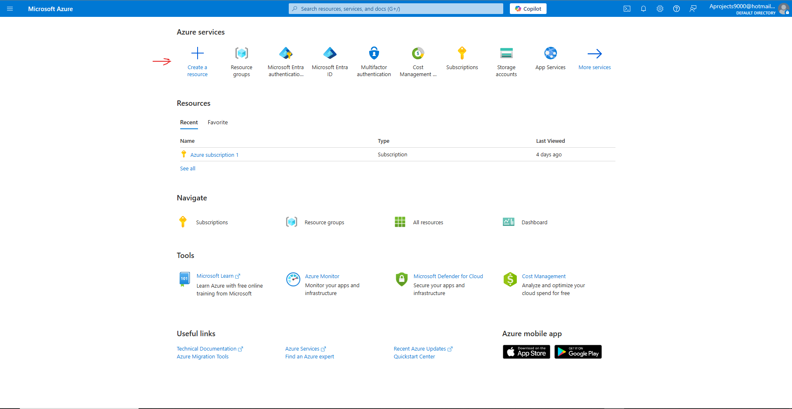
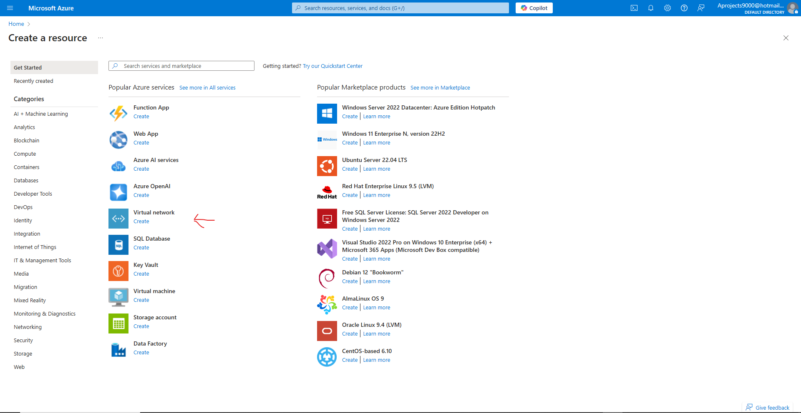
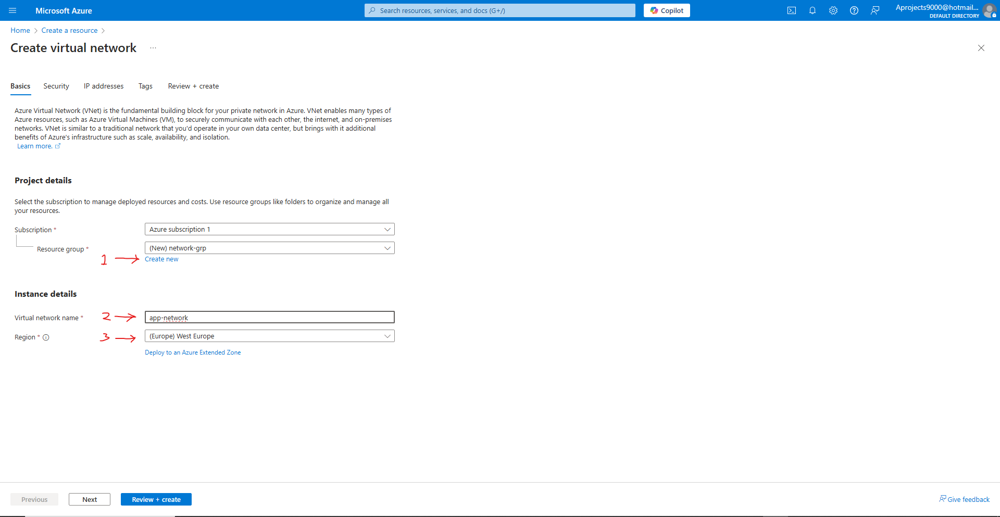
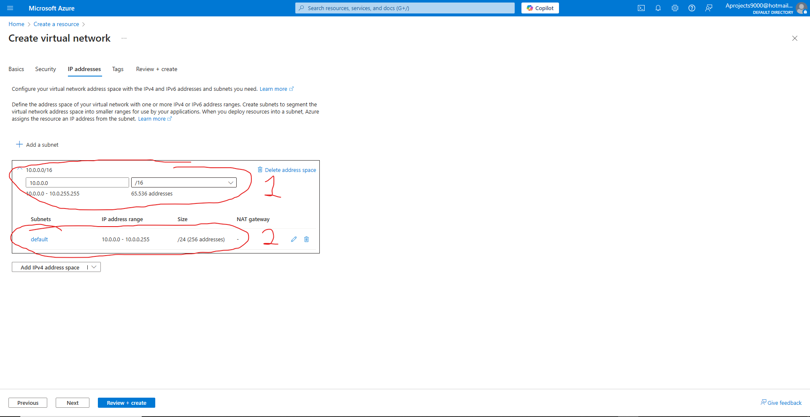
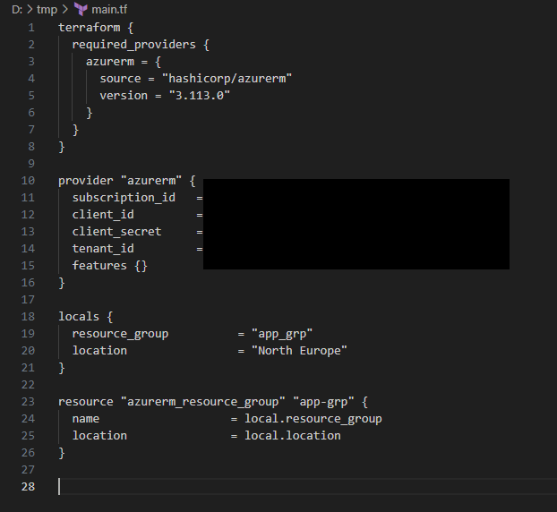
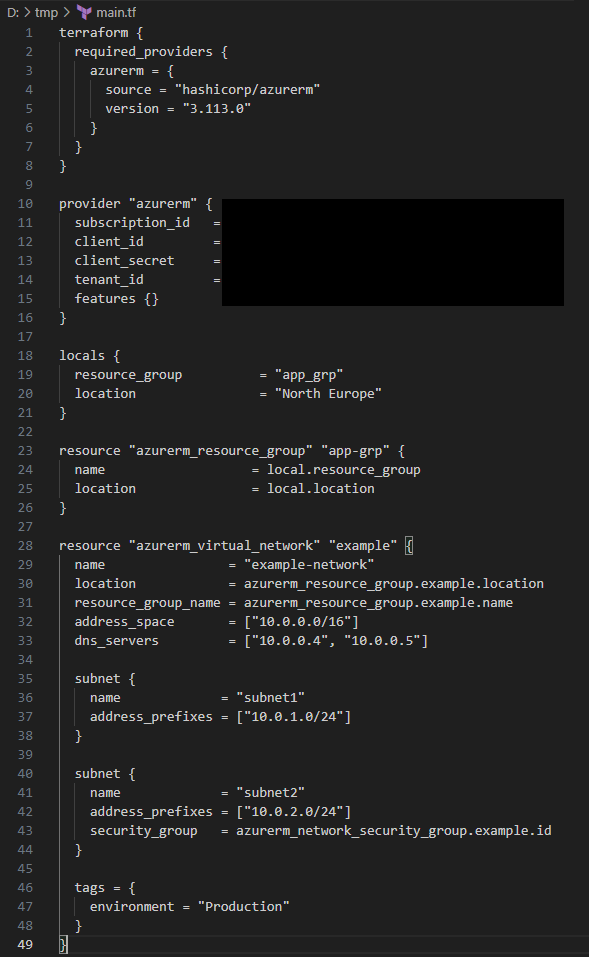
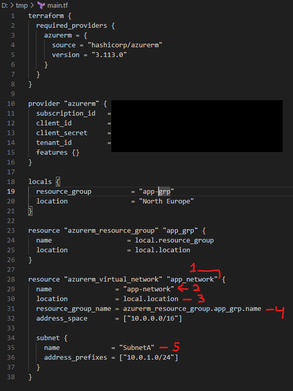

# Terraform - Azure - Part 12: Azure Infrastructure with Terraform - Lab - Creating an Azure virtual network
In this project I am going to learn to use Terraform in Azure. The reason for learning Terraform over ARM templates (or Bicep) is that Terraform can be used on other cloud platforms such as AWS and Google Cloud. I am following along with the [Azure Infrastructure with Terraform](https://www.youtube.com/playlist?list=PLLc2nQDXYMHowSZ4Lkq2jnZ0gsJL3ArAw) playlist from Alan Rodrigues. Thanks Alan.

## Project Table of Contents

- [Part 1: Azure Infrastructure with Terraform - What and Why Terraform](Part-01-Azure-Infrastructure-With-Terraform-What-and-Why-Terraform.md)
- [Part 2: Azure Infrastructure with Terraform - Concepts when it comes to Terraform](Part-02-Azure-Infrastructure-with-Terraform-Concepts-when-it-comes-to-Terraform.md)
- [Part 3: Azure Infrastructure with Terraform - Terraform workflow](Part-03-Azure-Infrastructure-with-Terraform-Terraform-workflow.md)
- [Part 4: Azure Infrastructure with Terraform - Installing Terraform](Part-04-Azure-Infrastructure-with-Terraform-Installing-Terraform.md)
- [Part 5: Azure Infrastructure with Terraform - Creating a resource group](Part-05-Azure-Infrastructure-with-Terraform-Creating-a-resource-group.md)
- [Part 6: Azure Infrastructure with Terraform - Creating an Azure Storage Account](Part-06-Azure-Infrastructure-with-Terraform-Creating-an-Azure-Storage-Account.md)
- [Part 7: Azure Infrastructure with Terraform - Terraform state](Part-07-Azure-Infrastructure-with-Terraform-Terraform-state.md)
- [Part 8: Azure Infrastructure with Terraform - Creating a container and a blob](Part-08-Azure-Infrastructure-with-Terraform-Creating-a-container-and-a-blob.md)
- [Part 9: Azure Infrastructure with Terraform - Dependencies between resources](Part-09-Azure-Infrastructure-with-Terraform-Dependencies-between-resources.md)
- [Part 10: Azure Infrastructure with Terraform - Destroying the resources](Part-10-Azure-Infrastructure-with-Terraform-Destroying-the-resources.md)
- [Part 11: Azure Infrastructure with Terraform - Using Variables](Part-11-Azure-Infrastructure-with-Terraform-Using-Variables.md)
- [Part 12: Azure Infrastructure with Terraform - Lab - Creating an Azure virtual network](Part-12-Azure-Infrastructure-with-Terraform-Lab-Creating-an-Azure-virtual-network.md)
- [Part 13: Azure Infrastructure with Terraform - Lab - Creating an Azure virtual machine](Part-13-Azure-Infrastructure-with-Terraform-Lab-Creating-an-Azure-virtual-machine.md)
- [Part 14: Azure Infrastructure with Terraform - Quick note on accessing Azure resource properties](Part-14-Azure-Infrastructure-with-Terraform-Quick-note-on-accessing-Azure-resource-properties.md)
- [Part 15: Azure Infrastructure with Terraform - Lab - Create Public IP Address](Part-15-Azure-Infrastructure-with-Terraform-Lab-Create-Public-IP-Address.md)
- [Part 16: Azure Infrastructure with Terraform - Lab - Adding data disks](Part-16-Azure-Infrastructure-with-Terraform-Lab-Adding-data-disks.md)
- [Part 17: Azure Infrastructure with Terraform - Lab - Availability Sets](Part-17-Azure-Infrastructure-with-Terraform-Lab-Availability-Sets.md)
- [Part 18: Azure Infrastructure with Terraform - Lab- Custom Script extensions](Part-18-Azure-Infrastructure-with-Terraform-Lab-Custom-Script-extensions.md)

## Part 1 Table of Contents

- [Intro](#intro)
- [Result](#result)

# Project

## Intro

In this video we're going through the process of creating a virtual network. First we'll do it through the Azure Portal and then through our Terraform config file. 

## Result

## [Part 12: Azure Infrastructure with Terraform - Lab - Creating an Azure virtual network](https://www.youtube.com/watch?v=m3gBwPg4pVE&list=PLLc2nQDXYMHowSZ4Lkq2jnZ0gsJL3ArAw&index=12)

### Creating a virtual network through the portal

I'm starting on the Azure Portal home page. From here we click on "create a resource":   

From there you can enter "virtual network" into the search bar. You can also select the option from the popular services list as I've done:  

From there we have to fill in a resource group name (1), network name (2) and we have to select a region (3):  

Then we will click on next until we get to the subnet page. We don't need to do anything here, but note how we can change the IP address range (1) and how there is one subnet added automatically (2):  

From there you can go to review & create and create the resource. Go and have a look around your resource to get more familiar with it. Try to find the address space and subnet for instance. 

Important aspects of the virtual network are: 

- Resource group
- Network name
- Region
- IP address space
- Subnet
- Subnet IP address space

make sure to delete your resources before continuing on.

### Creating a vnet in Terraform

Now we'll make our Terraform config file to deploy a virtual network through Terraform. 

First we'll need to have a resources template (example usage) to create the vnet. We can go to the [Terraform Azurerm documentation](https://registry.terraform.io/providers/hashicorp/azurerm/latest/docs) for this. Look up your virtual network in the search bar.

Leave the template for now and let's go to our existing config file. Here we'll delete our variable block and everything below the resource group resource block. It comes in handy if you chose to put the variable and local blocks at the top of the config file. Otherwise make sure you don't accidentally delete your local block. You'll be left with this:  

Now we'll copy the example usage from the virtual network resource block onward. Your file will now look like so:

From here we add a virtual network resource block name (1) as well as a name for the resource within Azure (2). We'll add a location from our local (3) and we'll reference our resource group for the resource group name (4). The dns server can be removed. It will then use the Azure dns server. We'll name our subnet "SubnetA" (5) and we'll remove the second subnet block and tag block. You'll end up with a config file like so:  

Now go through the process of creating your plan and deploying it. 

Congrats! 

When we deploy resources, often times multiple resources get deployed at the same time. For instance we'll deploy a virtual machine in the next video. This virtual machine will sit in a virtual network. It's good to know exactly what resources get deployed in accompaniment to the main resource you're deploying. 

Have a little look around your resources to further familiarise yourself and don't forget to delete all your resources before continuing or taking a well deserved break! Those are important too you know. 

&nbsp;
&nbsp;
-

Notes:
- Changed the app group name from app-grp to app_grp to keep consistent with Alan's video's.
- Changed resource group name in local block from app_grp to app-grp. Made a mistake when first making the local block. 
- An error occurred while creating a plan. Apparently "address_prefixes" isn't right. The solution is to make it singular: "address_prefix" and to remove the brackets around the IP address range. When you make it plural it expects a list (lists are contained in brackets) and somehow that doesn't work with inline defining of the subnet. This is an error on the documentation side. 

##  

