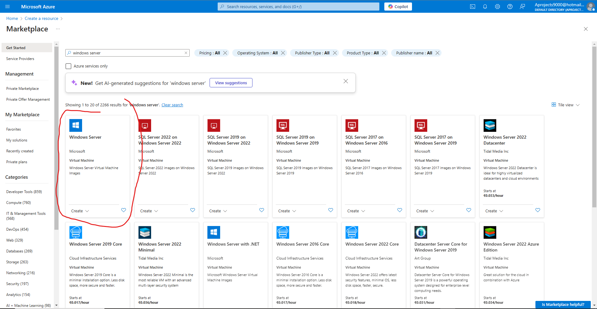
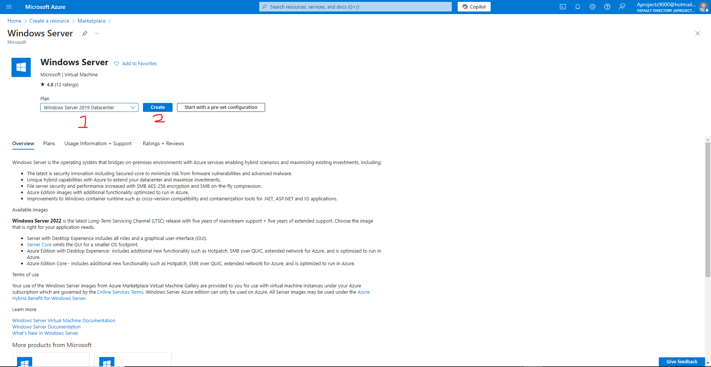
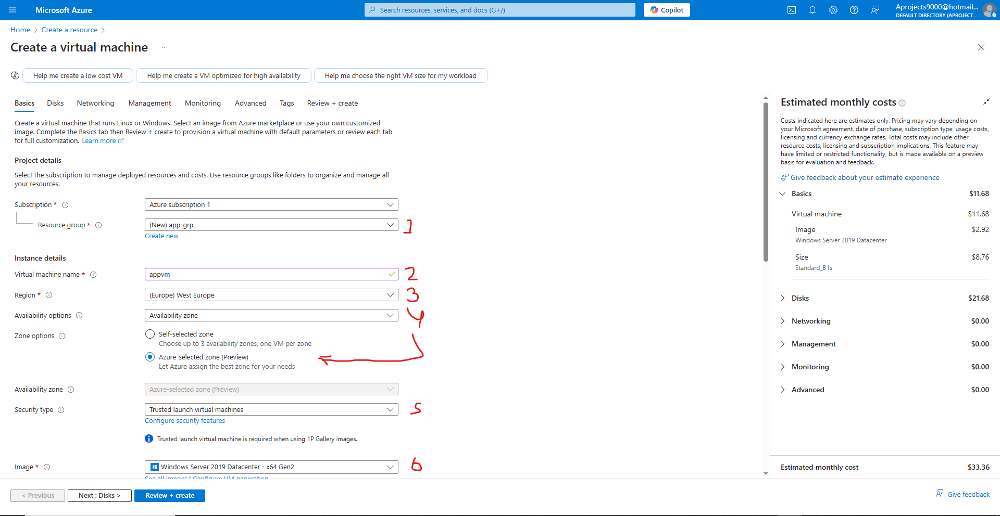
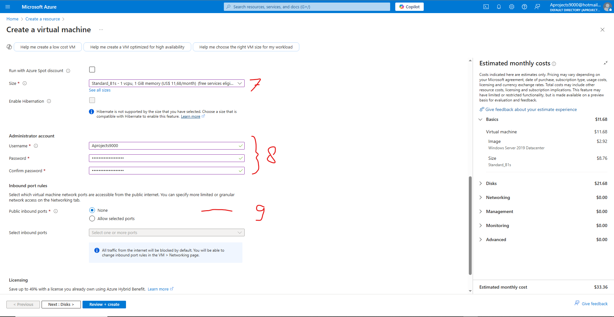
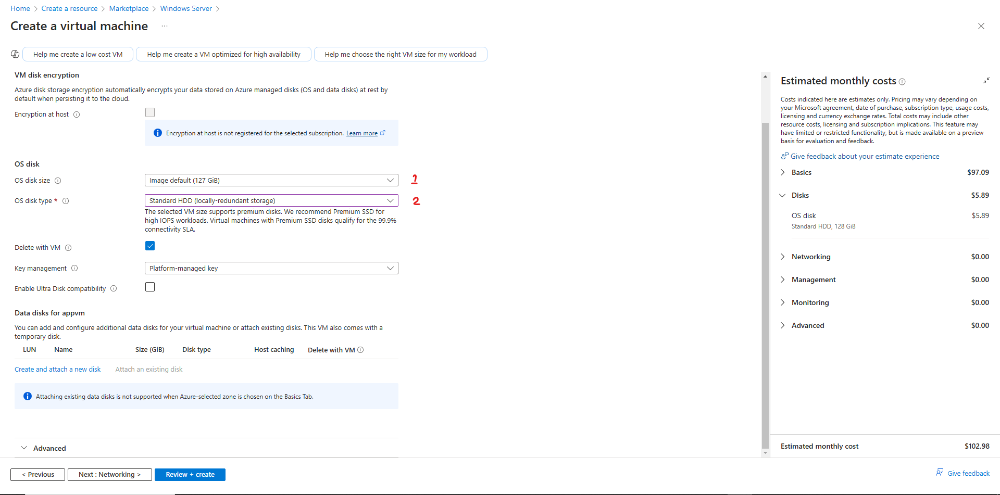
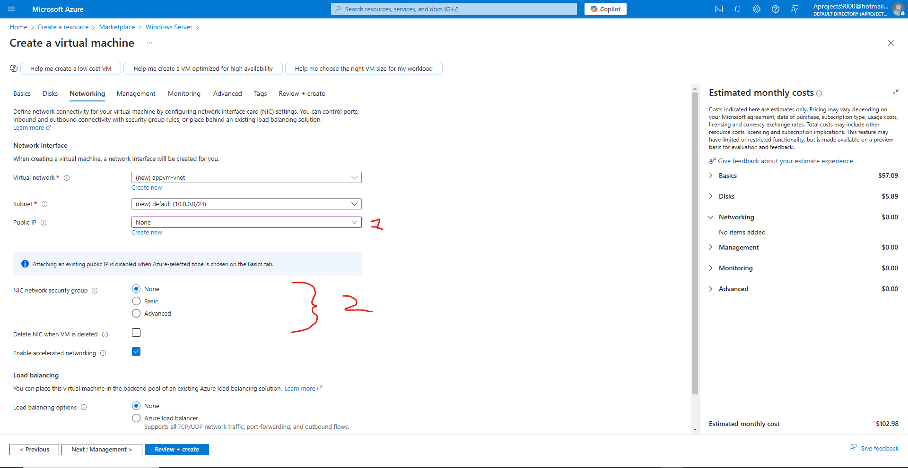
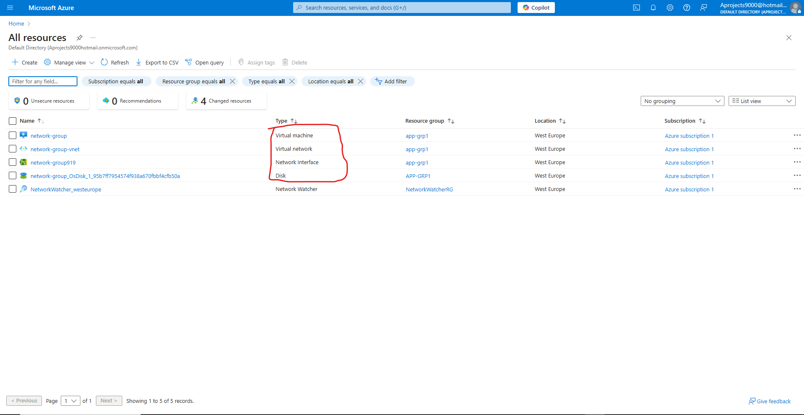

# Terraform - Azure - Part 13: Azure Infrastructure with Terraform - Lab - Creating an Azure virtual machine
In this project I am going to learn to use Terraform in Azure. The reason for learning Terraform over ARM templates (or Bicep) is that Terraform can be used on other cloud platforms such as AWS and Google Cloud. I am following along with the [Azure Infrastructure with Terraform](https://www.youtube.com/playlist?list=PLLc2nQDXYMHowSZ4Lkq2jnZ0gsJL3ArAw) playlist from Alan Rodrigues. Thanks Alan.

## Project Table of Contents
- [Part 1: Azure Infrastructure with Terraform - What and Why Terraform](Part-01-Azure-Infrastructure-With-Terraform-What-and-Why-Terraform.md)
- [Part 2: Azure Infrastructure with Terraform - Concepts when it comes to Terraform](Part-02-Azure-Infrastructure-with-Terraform-Concepts-when-it-comes-to-Terraform.md)
- [Part 3: Azure Infrastructure with Terraform - Terraform workflow](Part-03-Azure-Infrastructure-with-Terraform-Terraform-workflow.md)
- [Part 4: Azure Infrastructure with Terraform - Installing Terraform](Part-04-Azure-Infrastructure-with-Terraform-Installing-Terraform.md)
- [Part 5: Azure Infrastructure with Terraform - Creating a resource group](Part-05-Azure-Infrastructure-with-Terraform-Creating-a-resource-group.md)
- [Part 6: Azure Infrastructure with Terraform - Creating an Azure Storage Account](Part-06-Azure-Infrastructure-with-Terraform-Creating-an-Azure-Storage-Account.md)
- [Part 7: Azure Infrastructure with Terraform - Terraform state](Part-07-Azure-Infrastructure-with-Terraform-Terraform-state.md)
- [Part 8: Azure Infrastructure with Terraform - Creating a container and a blob](Part-08-Azure-Infrastructure-with-Terraform-Creating-a-container-and-a-blob.md)
- [Part 9: Azure Infrastructure with Terraform - Dependencies between resources](Part-09-Azure-Infrastructure-with-Terraform-Dependencies-between-resources.md)
- [Part 10: Azure Infrastructure with Terraform - Destroying the resources](Part-10-Azure-Infrastructure-with-Terraform-Destroying-the-resources.md)
- [Part 11: Azure Infrastructure with Terraform - Using Variables](Part-11-Azure-Infrastructure-with-Terraform-Using-Variables.md)
- [Part 12: Azure Infrastructure with Terraform - Lab - Creating an Azure virtual network](Part-12-Azure-Infrastructure-with-Terraform-Lab-Creating-an-Azure-virtual-network.md)
- [Part 13: Azure Infrastructure with Terraform - Lab - Creating an Azure virtual machine](Part-13-Azure-Infrastructure-with-Terraform-Lab-Creating-an-Azure-virtual-machine.md)
- [Part 14: Azure Infrastructure with Terraform - Quick note on accessing Azure resource properties](Part-14-Azure-Infrastructure-with-Terraform-Quick-note-on-accessing-Azure-resource-properties.md)

## Part 1 Table of Contents

- [Intro](#intro)
- [Result](#result)


# Project

<a id="intro"></a>

## Intro

In this video we're going through the process of creating a virtual machine. First we'll do it through the Azure Portal and then through our Terraform config file. 

<a id="result"></a>

## Result

## [Part 13: Azure Infrastructure with Terraform - Lab - Creating an Azure virtual machine](https://www.youtube.com/watch?v=2Y0_IRiiek4&list=PLLc2nQDXYMHowSZ4Lkq2jnZ0gsJL3ArAw&index=13)

### Creating a virtual machine through the portal

I'm starting on the Azure Portal home page. From here we click on "create a resource" just like in the previous part. Now we type in windows server in the search bar and select that:

  

From here we type in "Windows Server 2019 Datacenter (1) and click on "Create" (2): 

  

Now we create a new resource group "app-grp"(1). Next we name our virtual machine "appvm" (2). We pick a region (3). Just pick whatever region is closest to you. Then we select "Azure Selected Zone" (4). Now select Trusted Launch Virtual Machines (5). Make sure your Windows Server 2019 Datacenter is selected (6). Here we'll pick "Standard_B1s" (7). this is different from Alan's video, but it is the cheapest possible option. 

Since we're only practicing deploying resources, we don't need a well running virtual machine. By choosing the cheapest option we minimise the risks of forgetting to destroy our recourses later on. If we take the difference between Alan's choice ($118,77) and mine ($33,36), that's a difference of $85,41 in a month. Not the worst, but we're only talking about one virtual machine. Just imagine the extra costs when you unnecessarily choose a more expensive option while making a network for a company with 200 employees. 

Always be very conscious of the costs that come with resources and ask yourself if something is really necessary, and also if they can be turned off after hours. This is another great money saver and is sure to make someone in finance a happy camper.

  

  

Now continue on to disks. Here we'll choose the image default of 127 GB for the OS image disk size (1). For OS disk type we'll choose HDD locally redundant storage (2). This is also different from what Alan chooses and it is also because of costs. HDD is much cheaper than SSD, and LRS (Locally-Redundant Storage) is the cheapest backup option for your data. 

  

Then we go to networking. Here we change the Public IP to "None" (1). We change the NIC network security group to "None" too. 

  

Now we go ahead and create our virtual machine! Once our virtual machine has been created, go to "all resources" and you'll see all the resources that are created when we create a virtual machine. These resources will need to be created in our Terraform config file too:

- Our virtual machine, of course
- A virtual network 
- A network interface 
- And a disk
  
  

Now let's delete all the resources and continue on to making our Terraform config file.

### Creating a virtual machine through Terraform

First we'll retrieve the necessary Terraform documentation for our Windows virtual machine. We'll be using everything from the network interface onwards, since we already have our network in the config file. 

Let's go through all the aspects that are needed to make a virtual machine work. We've already seen all the resources needed, but there's one more aspect: 

The virtual machine is part of a Subnet. That subnet sits within a virtual network. The virtual machine needs a network interface in place and it also needs a OS disk. Let's explain those parts a little further

- **Virtual machine:** This is like your normal computer, but then virtualised. There are quite some differences between the two but they are not important to delve into here. 
- **Subnet:** A subnet is a subdivision of the virtual network. A network can be divided into multiple subnets for organisation and safety reasons. 
- **Virtual network:** A virtual network is a way for devices to connect to each other and communicate with each other. Let's say you have your computer and a printer. When you put these on the same network you'll be able to send a file from your computer to the printer so that the printer can then print said file. 
- **Network interface:** A network interface makes it possible for your virtual machine to connect to the virtual network. Think of it as the front door to the neighbourhood (The virtual network being the neighbourhood).
- **OS disk:** The OS disk is the virtual hard drive that stores the OS (Operating System) used to make the virtual machine operable. Windows is such an operating system.  
- 
&nbsp;
&nbsp;


Now let's look at the network interface resource:

```
resource "azurerm_network_interface" "app_interface" {
  name                = "app-interface"
  location            = local.location
  resource_group_name = local.resource_group

  ip_configuration {
    name                          = "internal"
    subnet_id                     = azurerm_subnet.SubnetA.id
    private_ip_address_allocation = "Dynamic"
  }

  depends_on = [
    azurerm_virtual_network.app_network
  ]

}
```

Make sure yours is similar and I'll go through what's new:

```
ip_configuration {
    name                          = "internal"
    subnet_id                     = azurerm_subnet.SubnetA.id
    private_ip_address_allocation = "Dynamic"
  }
```

The ip configuration is used to configure an ip for the virtual machine. Makes sense right? To do so we need to know the subnet id. When a network is already created we can use something that's called a data source to look up the subnet id (At the bottom of the file you'll find what to do when there's no subnet yet to fetch information from. we'll go into the data source anyway because it's a very useful tool). 

Here's what the data source will look like:

```
data "azurerm_subnet" "SubnetA" {
  name                  = "SubnetA"
  virtual_network_name  = "app-network"
  resource_group_name   = local.resource_group
}
```

```data``` This tells Terraform that it needs to look up an existing resource. This in contrast to the ```resource``` block type, where a new resource would be created. 

The rest of the block works as usual. 

&nbsp;
&nbsp;

To use this data source to find the subnet id, we use ```data.azurerm_subnet.SubnetA.id```.

Let's continue to the windows virtual machine resource block:

```
resource "azurerm_windows_virtual_machine" "app_vm" {
  name                = "app-vm"
  resource_group_name = local.resource_group
  location            = local.location
  size                = "Standard_B1s"
  admin_username      = "adminuser"
  admin_password      = "P@$$w0rd1234!"
  network_interface_ids = [
    azurerm_network_interface.app_interface.id,
  ]

  os_disk {
    caching              = "ReadWrite"
    storage_account_type = "Standard_LRS"
  }

  source_image_reference {
    publisher = "MicrosoftWindowsServer"
    offer     = "WindowsServer"
    sku       = "2019-Datacenter"
    version   = "latest"
  }

  depends_on [
    azurerm_network_interface.app_interface
  ]
}
```

I'll go through what's new:

```
size                = "Standard_B1s"
```  
Here I've chosen the smallest possible size. I hadn't looked through all sizes yet when creating the vm through the portal, but this is the cheapest option which will suffice for this use case. Remember, always be conscious of the costs of the resources you're creating. 

```
admin_username      = "adminuser"
admin_password      = "P@$$w0rd1234!"
```
Here we create a username and passwords. There is a secure way of adding the password, but we'll get to that later on in the course. 

```
network_interface_ids = [
    azurerm_network_interface.app_interface.id,
  ]
```
Here we're fetching our network interface id. This is the same id we made a data source for to fetch it in the network interface resource block. 

```
os_disk {
    caching              = "ReadWrite"
    storage_account_type = "Standard_LRS"
}
```
We leave it as is so we'll skip this part for now.

```
source_image_reference {
    publisher = "MicrosoftWindowsServer"
    offer     = "WindowsServer"
    sku       = "2019-Datacenter"
    version   = "latest"
  }
```
Here we're choosing what Windows image will go onto our virtual machine. 

We  also add a depends on clause to make sure our network interface resource is deployed before the virtual machine gets deployed. 

```
depends_on = [
    azurerm_network_interface.app_interface
  ]
```

Finally we also add a depends on clause to the network interface for the virtual network. 

```
depends_on = [
    azurerm_virtual_network.app_network
  ]
```


There will probably be an error. See the last note down below to solve it. 

You done gone did it. Congrats! Let's destroy the resources and continue on. 


&nbsp;
&nbsp;
-


Notes:
- Changed the app group name from app-grp to app_grp to keep consistent with Alan's video's.
- Changed resource group name in local block from app_grp to app-grp. Made a mistake when first making the local block. 
- An error occurred while creating a plan. Apparently "address_prefixes" isn't right. The solution is to make it singular: "address_prefix" and to remove the brackets around the IP address range. When you make it plural it expects a list (lists are contained in brackets) and somehow that doesn't work with inline defining of the subnet. This is an error on the documentation side. 
- The Windows Server 2019 Datacenter has been replaced by 2022 datacenter in the quick menu. To keep consistency on that level I've chosen to alter the walkthrough a bit in the portal. 

- The plan would not execute because a data block cannot fetch information from a resource that doesn't exist yet, and I've chosen to remove all resources at the end of each exercise. What I've found out is that you only need a data block when you want to fetch information from a resource not managed within the Terraform file you're working with. I can reference the resource directly. To make this possible, however, I did need to change the config file so that the subnet is not inline with the network resource, but is its own resource:

```
resource "azurerm_subnet" "SubnetA" {
  name                 = "SubnetA"
  resource_group_name  = azurerm_resource_group.app_grp.name
  virtual_network_name = azurerm_virtual_network.app_network.name
  address_prefixes     = ["10.0.1.0/24"]
}
```

Then to fetch the subnet id I use ```azurerm_subnet.SubnetA.id``` :

```
ip_configuration {
    name                          = "internal"
    subnet_id                     = azurerm_subnet.SubnetA.id
    private_ip_address_allocation = "Dynamic"
  }
```
That solved the error. 

- In the future I will only use a data block for resources not managed within Terraform. Especially while doing this course. 
- I done gone and deleted the whole process of creating a virtual machine, both through the portal and through Terraform. I saved part 14 over part 13 without realising and closed off for the night. Ain't that a bitch. 

## []() 


