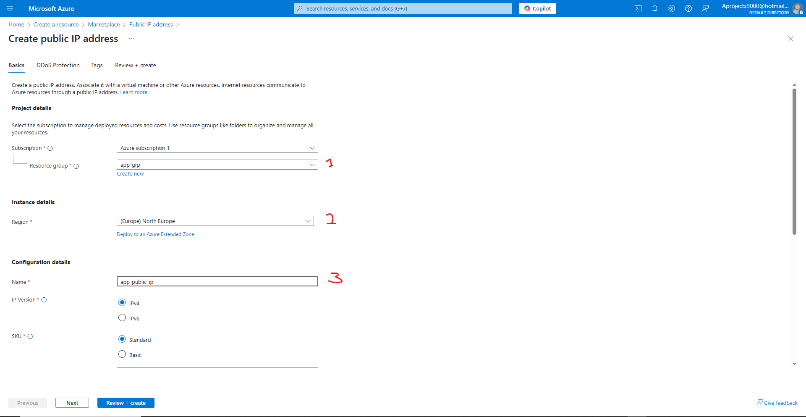
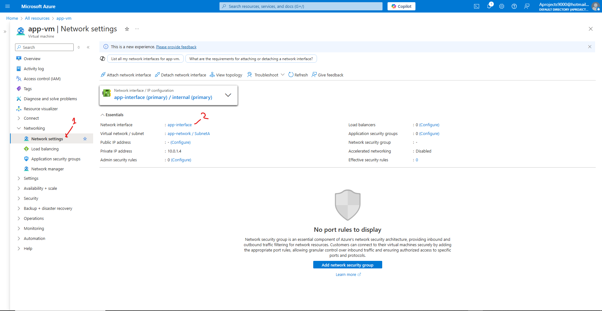
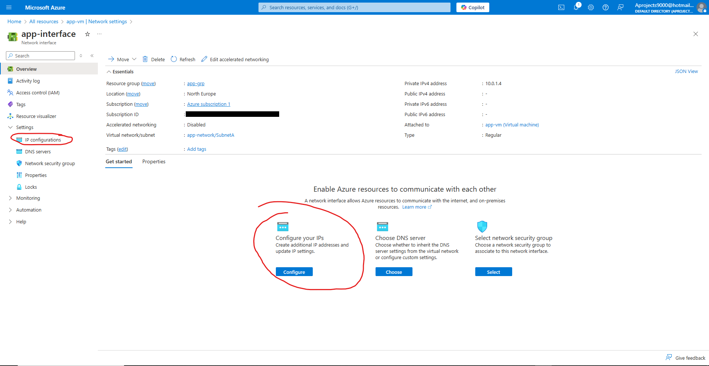
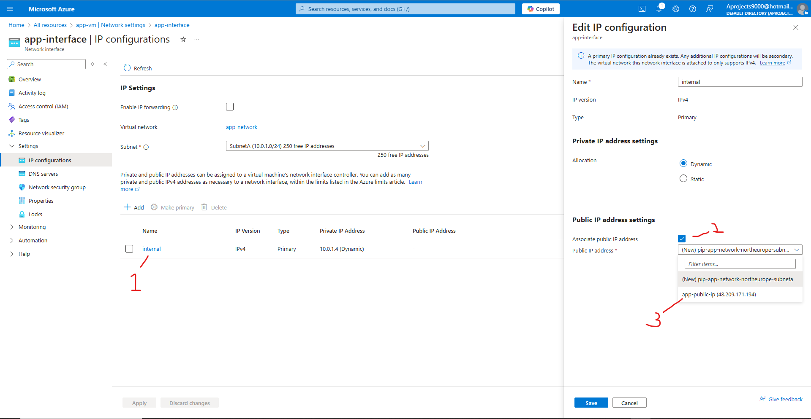
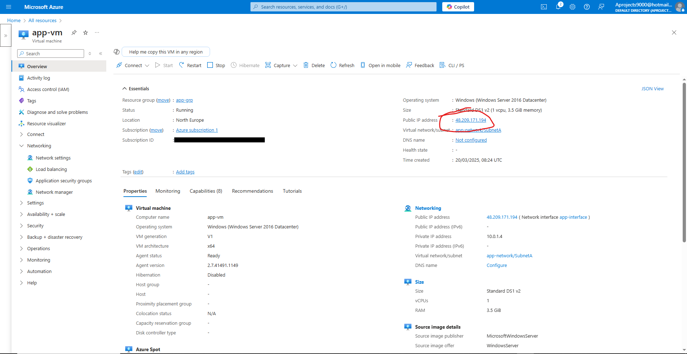

# Terraform - Azure - Part 15: Azure Infrastructure with Terraform - Lab - Create Public IP Address
In this project I am going to learn to use Terraform in Azure. The reason for learning Terraform over ARM templates (or Bicep) is that Terraform can be used on other cloud platforms such as AWS and Google Cloud. I am following along with the [Azure Infrastructure with Terraform](https://www.youtube.com/playlist?list=PLLc2nQDXYMHowSZ4Lkq2jnZ0gsJL3ArAw) playlist from Alan Rodrigues. Thanks Alan.

## Project Table of Contents

- [Part 1: Azure Infrastructure with Terraform - What and Why Terraform](Part-01-Azure-Infrastructure-With-Terraform-What-and-Why-Terraform.md)
- [Part 2: Azure Infrastructure with Terraform - Concepts when it comes to Terraform](Part-02-Azure-Infrastructure-with-Terraform-Concepts-when-it-comes-to-Terraform.md)
- [Part 3: Azure Infrastructure with Terraform - Terraform workflow](Part-03-Azure-Infrastructure-with-Terraform-Terraform-workflow.md)
- [Part 4: Azure Infrastructure with Terraform - Installing Terraform](Part-04-Azure-Infrastructure-with-Terraform-Installing-Terraform.md)
- [Part 5: Azure Infrastructure with Terraform - Creating a resource group](Part-05-Azure-Infrastructure-with-Terraform-Creating-a-resource-group.md)
- [Part 6: Azure Infrastructure with Terraform - Creating an Azure Storage Account](Part-06-Azure-Infrastructure-with-Terraform-Creating-an-Azure-Storage-Account.md)
- [Part 7: Azure Infrastructure with Terraform - Terraform state](Part-07-Azure-Infrastructure-with-Terraform-Terraform-state.md)
- [Part 8: Azure Infrastructure with Terraform - Creating a container and a blob](Part-08-Azure-Infrastructure-with-Terraform-Creating-a-container-and-a-blob.md)
- [Part 9: Azure Infrastructure with Terraform - Dependencies between resources](Part-09-Azure-Infrastructure-with-Terraform-Dependencies-between-resources.md)
- [Part 10: Azure Infrastructure with Terraform - Destroying the resources](Part-10-Azure-Infrastructure-with-Terraform-Destroying-the-resources.md)
- [Part 11: Azure Infrastructure with Terraform - Using Variables](Part-11-Azure-Infrastructure-with-Terraform-Using-Variables.md)
- [Part 12: Azure Infrastructure with Terraform - Lab - Creating an Azure virtual network](Part-12-Azure-Infrastructure-with-Terraform-Lab-Creating-an-Azure-virtual-network.md)
- [Part 13: Azure Infrastructure with Terraform - Lab - Creating an Azure virtual machine](Part-13-Azure-Infrastructure-with-Terraform-Lab-Creating-an-Azure-virtual-machine.md)
- [Part 14: Azure Infrastructure with Terraform - Quick note on accessing Azure resource properties](Part-14-Azure-Infrastructure-with-Terraform-Quick-note-on-accessing-Azure-resource-properties.md)
- [Part 15: Azure Infrastructure with Terraform - Lab - Create Public IP Address](Part-15-Azure-Infrastructure-with-Terraform-Lab-Create-Public-IP-Address.md)
- [Part 16: Azure Infrastructure with Terraform - Lab - Adding data disks](Part-16-Azure-Infrastructure-with-Terraform-Lab-Adding-data-disks.md)
- [Part 17: Azure Infrastructure with Terraform - Lab - Availability Sets](Part-17-Azure-Infrastructure-with-Terraform-Lab-Availability-Sets.md)
- [Part 18: Azure Infrastructure with Terraform - Lab- Custom Script extensions](Part-18-Azure-Infrastructure-with-Terraform-Lab-Custom-Script-extensions.md)

## Part 1 Table of Contents

- [Intro](#intro)
- [Result](#result)


# Project

<a id="intro"></a>

## Intro

In this video we're going to create a public IP address. A public IP address is a unique number assigned to your internet connection that allows devices on the internet to find and communicate with you.

<a id="result"></a>

## Result

## [Part 15: Azure Infrastructure with Terraform - Lab - Create Public IP Address](https://www.youtube.com/watch?v=XiQpKnUdY9Q&list=PLLc2nQDXYMHowSZ4Lkq2jnZ0gsJL3ArAw&index=15)

In part 13 we created a virtual machine. If you want to log into it, you need a public IP address. We talked about all the necessary resources for a virtual machine. A public IP address is added to that list. Let's go ahead and modify our Terraform config file to make this happen.

First we need to deploy our virtual machine so that we can go through the process of adding a public IP through the portal.

### Creating a public IP through the portal

Let's create a new resource and search for public IP address. If you're not yet familiar with the process you can go back to previous parts or you can follow along with Alan's video. I'll start from the setup menu:

We'll make sure that the right resource group is selected (1). We'll also choose the same location as the virtual machine (2). This is because resources that will work together need to be deployed in the same location. Then we'll create a resource name (3). Now we can create the resource:  



Now in 'all resources' you'll find the public IP. 

Next we'll go onto our vm (virtual machine) resource and go to network settings (1), followed by going to the network interface (2):  



Then we go to IP configurations. Choose either option:



Now, we go onto the IP config (1), from here we associate a public IP (2) and then we choose our created public IP address (3):



The public IP address will be attached to the network interface, which will in turn be attached to the virtual machine.

If we now go back to our virtual machine, specifically it's overview, we will see that the public IP is attached:



Now we're going to do the whole shebang again through Terraform. Let's go back to our IP config (two images back) and disassociate our IP and then delete our public IP address resource. Do not delete all the other resources this time! Only the public IP.

### Creating a public IP address through Terraform

Let's fetch the public IP resource block from the Terraform registry and add it to the bottom of our Terraform config file. 

let's walk through the resource block to recap and explain the new argument:

```
resource "azurerm_public_ip" "app_public_ip" {
  name                = "app-public-ip"
  resource_group_name = local.resource_group
  location            = local.location
  allocation_method   = "Static"
}
```  

```"azurerm_public_ip" "app_public_ip"```  

First we have our resource type and name for the resource block.

```name                = "app-public-ip"```  

Then we have the name we give to the resource within Azure.

```resource_group_name = local.resource_group```  

Here we have the reference to the resource group in our config file, so that Terraform knows in what resource group to place the public IP. It is also possible to create a new resource group by giving it a new name through a string value instead of referring to the name argument in our locals block.  

```location            = local.location```  

This defines the location. Using a reference to a locals block location argument for all resources will assure that they all have the same location and will work together.  

```allocation_method   = "Static"```

Here we have a new argument. The allocation method is set to static. this means it is a static IP allocation, instead of a dynamic IP. The difference being that a static IP is fixed and a dynamic IP can change over time. When you want a reliable and secure IP address you'll want to choose a static IP. For general browsing a dynamic IP works just fine and is also cheaper. So in a home network you'll most likely find that your router is configured with a dynamic IP.  

&nbsp;

In order to assign the public IP address to our vm, we need to assign it to the ip configuration of our network interface with the following argument: ```public_ip_address_id = azurerm_public_ip.app_public_ip```.

We'll also need to assign a new dependency argument (actually called a meta argument, since it controls how Terraform behaves instead of passing on any values to the underlying resource provider) to the network interface: ```azurerm_public_ip.app_public_ip```.

The network interface resource block will look like so:

```
resource "azurerm_network_interface" "app_interface" {
  name                = "app-interface"
  location            = local.location
  resource_group_name = local.resource_group

  ip_configuration {
    name                          = "internal"
    subnet_id                     = azurerm_subnet.SubnetA.id
    private_ip_address_allocation = "Dynamic"
    public_ip_address_id = azurerm_public_ip.app_public_ip
  }

  depends_on = [
    azurerm_virtual_network.app_network,
    azurerm_public_ip.app_public_ip
  ]
}
```

Now let's save the file and deploy our public IP!

I didn't actually get an error, but there was still a mistake. We need to add "id" to the ```public_ip_address_id``` property expression in our ip configuration. Makes sense. Let's change that to ```azurerm_public_ip.app_public_ip.id```.  

See the notes to see how I solved an error that decided to show up unexpectedly in the end.

Done! Let's delete our resources and continue.


&nbsp;
&nbsp;
-
Notes:

- For some weird reason the change that I didn't mean to make (setting ```vm_agent_platform_updates_enabled``` to ```false```) creates the following error:  
```
 Error: Unsupported argument
│
│   on main.tf line 37, in resource "azurerm_virtual_network" "app_network":
│   37:     address_prefixes = "10.0.1.0/24"
│
│ An argument named "address_prefixes" is not expected here. Did you mean "address_prefix"?
```

I don't know if the inline subnet block in the virtual network was always there, but that whole part should be gone since there is a separate resource block for a subnet. That was the problem that weirdly didn't create any deployment issues for a bit. 


