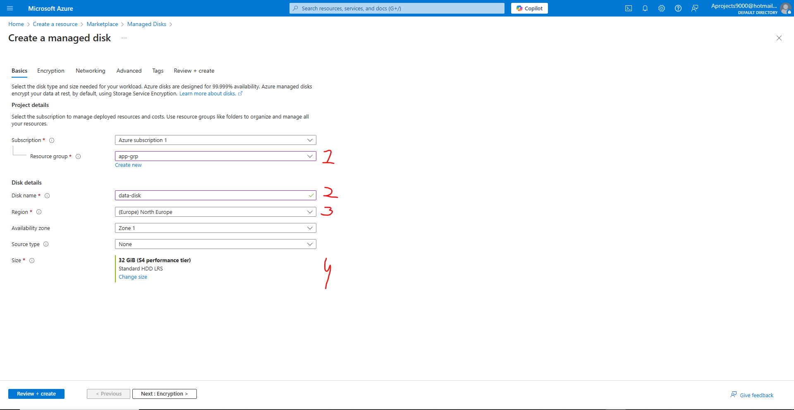
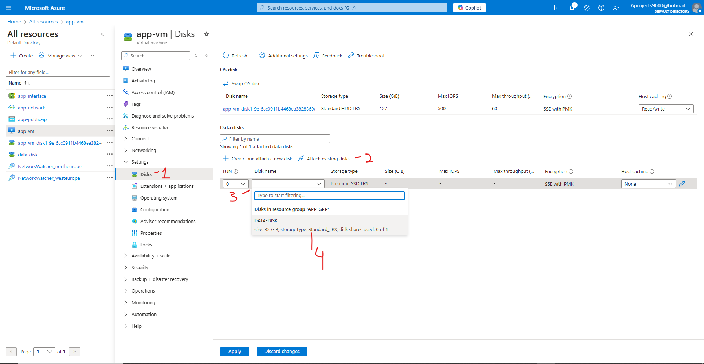
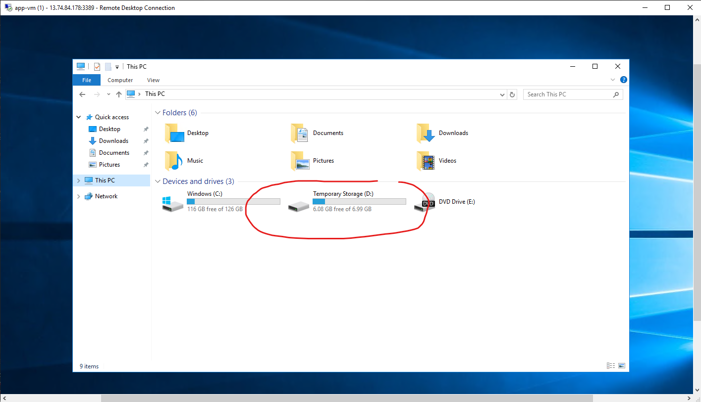
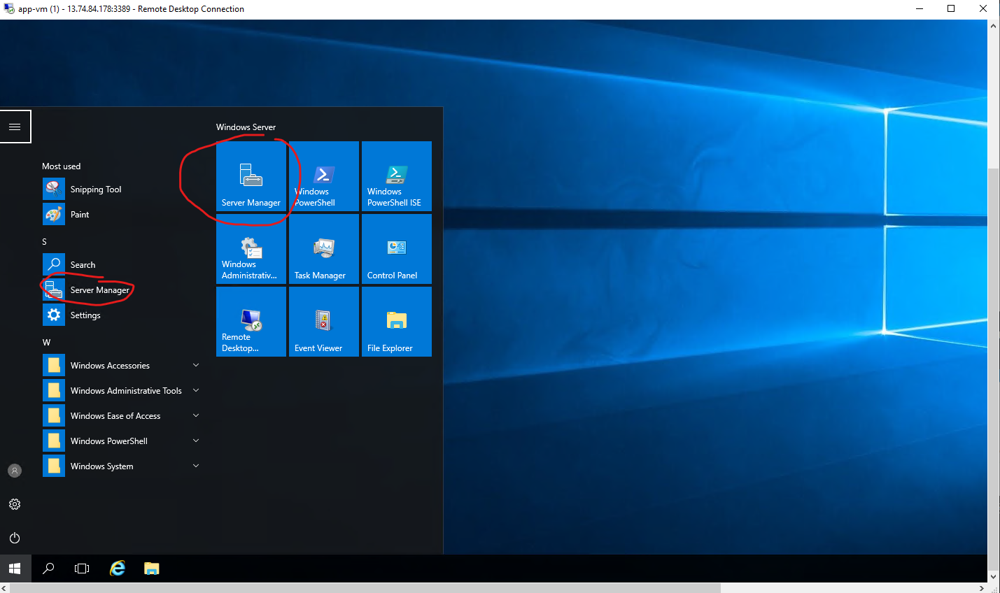
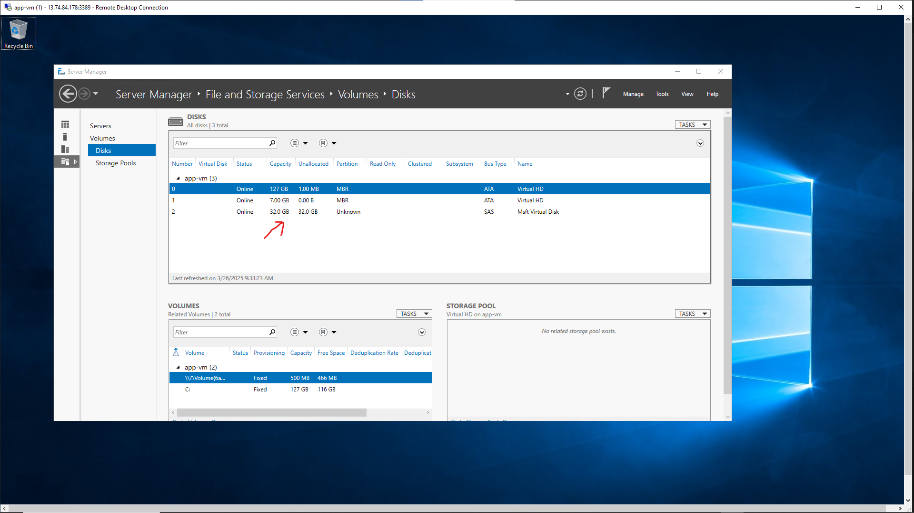
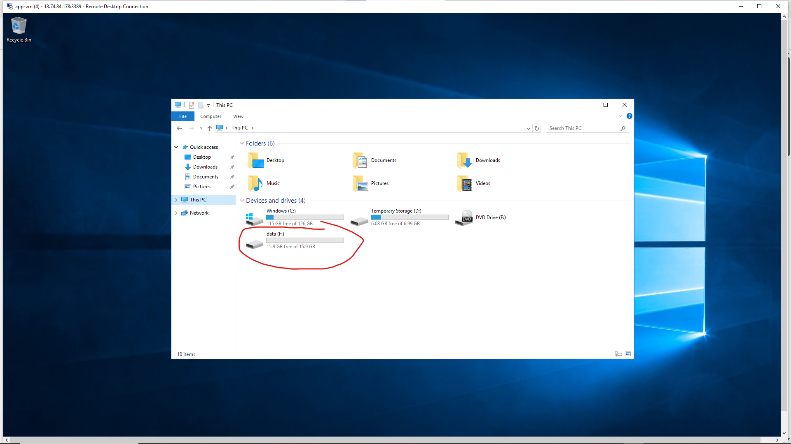

# Terraform - Azure - Part 16: Azure Infrastructure with Terraform - Lab - Adding data disks
In this project I am going to learn to use Terraform in Azure. The reason for learning Terraform over ARM templates (or Bicep) is that Terraform can be used on other cloud platforms such as AWS and Google Cloud. I am following along with the [Azure Infrastructure with Terraform](https://www.youtube.com/playlist?list=PLLc2nQDXYMHowSZ4Lkq2jnZ0gsJL3ArAw) playlist from Alan Rodrigues. Thanks Alan.

## Project Table of Contents

- [Part 1: Azure Infrastructure with Terraform - What and Why Terraform](Part-01-Azure-Infrastructure-With-Terraform-What-and-Why-Terraform.md)
- [Part 2: Azure Infrastructure with Terraform - Concepts when it comes to Terraform](Part-02-Azure-Infrastructure-with-Terraform-Concepts-when-it-comes-to-Terraform.md)
- [Part 3: Azure Infrastructure with Terraform - Terraform workflow](Part-03-Azure-Infrastructure-with-Terraform-Terraform-workflow.md)
- [Part 4: Azure Infrastructure with Terraform - Installing Terraform](Part-04-Azure-Infrastructure-with-Terraform-Installing-Terraform.md)
- [Part 5: Azure Infrastructure with Terraform - Creating a resource group](Part-05-Azure-Infrastructure-with-Terraform-Creating-a-resource-group.md)
- [Part 6: Azure Infrastructure with Terraform - Creating an Azure Storage Account](Part-06-Azure-Infrastructure-with-Terraform-Creating-an-Azure-Storage-Account.md)
- [Part 7: Azure Infrastructure with Terraform - Terraform state](Part-07-Azure-Infrastructure-with-Terraform-Terraform-state.md)
- [Part 8: Azure Infrastructure with Terraform - Creating a container and a blob](Part-08-Azure-Infrastructure-with-Terraform-Creating-a-container-and-a-blob.md)
- [Part 9: Azure Infrastructure with Terraform - Dependencies between resources](Part-09-Azure-Infrastructure-with-Terraform-Dependencies-between-resources.md)
- [Part 10: Azure Infrastructure with Terraform - Destroying the resources](Part-10-Azure-Infrastructure-with-Terraform-Destroying-the-resources.md)
- [Part 11: Azure Infrastructure with Terraform - Using Variables](Part-11-Azure-Infrastructure-with-Terraform-Using-Variables.md)
- [Part 12: Azure Infrastructure with Terraform - Lab - Creating an Azure virtual network](Part-12-Azure-Infrastructure-with-Terraform-Lab-Creating-an-Azure-virtual-network.md)
- [Part 13: Azure Infrastructure with Terraform - Lab - Creating an Azure virtual machine](Part-13-Azure-Infrastructure-with-Terraform-Lab-Creating-an-Azure-virtual-machine.md)
- [Part 14: Azure Infrastructure with Terraform - Quick note on accessing Azure resource properties](Part-14-Azure-Infrastructure-with-Terraform-Quick-note-on-accessing-Azure-resource-properties.md)
- [Part 15: Azure Infrastructure with Terraform - Lab - Create Public IP Address](Part-15-Azure-Infrastructure-with-Terraform-Lab-Create-Public-IP-Address.md)
- [Part 16: Azure Infrastructure with Terraform - Lab - Adding data disks](Part-16-Azure-Infrastructure-with-Terraform-Lab-Adding-data-disks.md)
- [Part 17: Azure Infrastructure with Terraform - Lab - Availability Sets](Part-17-Azure-Infrastructure-with-Terraform-Lab-Availability-Sets.md)
- [Part 18: Azure Infrastructure with Terraform - Lab- Custom Script extensions](Part-18-Azure-Infrastructure-with-Terraform-Lab-Custom-Script-extensions.md)

## Part 1 Table of Contents

- [Intro](#intro)
- [Result](#result)


# Project

<a id="intro"></a>

## Intro

In this video we're going to add a data disk to our virtual network. We already have an OS disk but there are reasons you could want your data separate from your OS disk. For instance if you want to easily back up data separately, or if you need to mount persistent volumes (e.g., Kubernetes, Docker).

<a id="result"></a>

## Result

## [Part 16: Azure Infrastructure with Terraform - Lab - Adding data disks](https://www.youtube.com/watch?v=A6_omQIxa4g&list=PLLc2nQDXYMHowSZ4Lkq2jnZ0gsJL3ArAw&index=16)

### Creating a data disk through the portal

Let's deploy our resources again through Terraform. When that's done go to create a resource on the portal and look for managed disks. In the basics menu we'll choose our existing resource group (1), then name our data disk (2). Next we make sure the location is the same as our other resources (3). Finally we choose the smallest and slowest option since we won't need it to actually store anything right now (4). Go ahead and create the resource:  

  

Now we'll go to our virtual machine. Here we'll go to the disks menu under settings (1). From there we attach a new disk (2), open up the dropdown menu (3) and select our created data disk (4). Go ahead and apply the changes:  

  

In Alan's video he also saves after applying the changes, so that the virtual machine updates. This is not necessary anymore. It will update automatically when applying the changes.   


Now if we go onto our virtual machine and go to our file manager, we can see that there is a temporary storage disk:  

  

This disk is part of the virtual machine deployment. It is not our data disk resource. In order to assign or create a volume out of our data disk, we have to go to 'server manager' on our vm. It should pop up in the menu bar: 

  

Once selected we will go to file and storage services, then volumes, and then disks. We'll see our 32 gb disk on the list:  

  

We will not do anything here. Instead, we'll go back onto the Azure platform and to the vm disks menu to detach our data disk (this can be done on the right hand side of the disk next to the host caching option) and apply.  

Now we will do it all in Terraform, as well as assign a volume with our data disk to the virtual machine.  

No need to delete all the resources if you're going to continue. Just delete the data disk through the portal.  

### Creating a data disk through Terraform  

We'll go get the necessary resource blocks from the Terraform Azurerm documentation:  

```
resource "azurerm_managed_disk" "data_disk" {
  name                 = "data-disk"
  location             = local.location
  resource_group_name  = local.resource_group
  storage_account_type = "Standard_LRS"
  create_option        = "Empty"
  disk_size_gb         = "16"
}
```  

Let me explain the new arguments:  


```storage_account_type = "Standard_LRS"```  

Here we choose locally redundant storage type. Meaning it gets duplicated three times in one location.  

```create_option        = "Empty"```  

This means we create an empty data disk.

```disk_size_gb         = "16"```  

Here we define that the data disk will be 16 GB.  

Now if we want to attach the data disk, we need another resource, the data disk attachment resource:  

```
resource "azurerm_virtual_machine_data_disk_attachment" "disk_attach" {
  managed_disk_id    = azurerm_managed_disk.data_disk.id
  virtual_machine_id = azurerm_windows_virtual_machine.app_vm.id
  lun                = "0"
  caching            = "ReadWrite"
  depends_on= [
    azurerm_windows_virtual_machine.app_vm,
    azurerm_managed_disk.data_disk
  ]
}
```  

```lun               = "0"```
This is the logical unit number, it is for organising purposes.    

```caching           = "ReadWrite"```  
This decides what operations get cached (temporarily saved) on a local ssd disk that is situated in the same physical server as your vm. Since these operations get saved so close, compared to your data disk that might be ssd but is connected through a network, the computer can access this data much quicker. This can improve operation speed significantly, but the trade off is a risk of data loss before it is written to the data disk. We've chosen for read and write operations. This will improve the speed of both operations.  

The resource depends on having a vm and data disk, so we add those dependencies.  

Now let's save our config file and deploy our new resources. When they're deployed we'll go into our vm and back to the server manager, file and storage services and then volumes, disks. You'll see your new disk!

On the top right you'll see "TASKS." Click on it and select re-scan so that it will reflect the current state. After doing so, right click and select "new volume." Just click on next until you can give the volume a name, or "label." Name it however you like and continue the process. After it's done you can go to your file explorer and you'll find your new volume! I named mine "data":  

  

That was it for this lesson. Do the ol' resourcus deletus and either have a nice break or continue on! 


&nbsp;
&nbsp;
-
Notes: 
- We had to go onto the virtual machine now and it becomes very noticeable how slow everything is. From here on out I'm choosing a little more power to run the machines. 
- When looking up resources in the search bar of the Azurerm documentation, make sure to underscore instead of use spaces. The same way how they're named within the config file. Otherwise the search will come up empty. (This was either a temporary thing or I fudged something up. In part 18 I found this problem was gone.)


