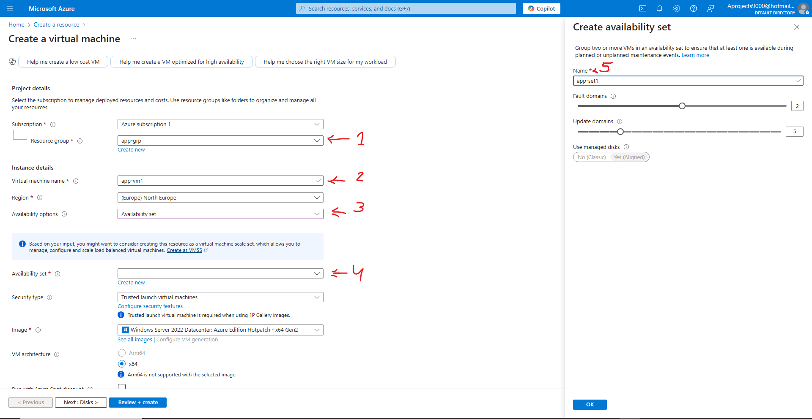
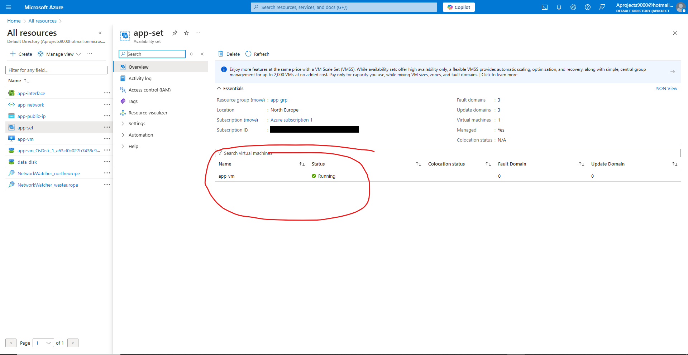

# Terraform - Azure - Part 17: Azure Infrastructure with Terraform - Lab - Availability Sets

In this project I am going to learn to use Terraform in Azure. The reason for learning Terraform over ARM templates (or Bicep) is that Terraform can be used on other cloud platforms such as AWS and Google Cloud. I am following along with the [Azure Infrastructure with Terraform](https://www.youtube.com/playlist?list=PLLc2nQDXYMHowSZ4Lkq2jnZ0gsJL3ArAw) playlist from Alan Rodrigues. Thanks Alan.

## Project Table of Contents

- [Part 1: Azure Infrastructure with Terraform - What and Why Terraform](Part-01-Azure-Infrastructure-With-Terraform-What-and-Why-Terraform.md)
- [Part 2: Azure Infrastructure with Terraform - Concepts when it comes to Terraform](Part-02-Azure-Infrastructure-with-Terraform-Concepts-when-it-comes-to-Terraform.md)
- [Part 3: Azure Infrastructure with Terraform - Terraform workflow](Part-03-Azure-Infrastructure-with-Terraform-Terraform-workflow.md)
- [Part 4: Azure Infrastructure with Terraform - Installing Terraform](Part-04-Azure-Infrastructure-with-Terraform-Installing-Terraform.md)
- [Part 5: Azure Infrastructure with Terraform - Creating a resource group](Part-05-Azure-Infrastructure-with-Terraform-Creating-a-resource-group.md)
- [Part 6: Azure Infrastructure with Terraform - Creating an Azure Storage Account](Part-06-Azure-Infrastructure-with-Terraform-Creating-an-Azure-Storage-Account.md)
- [Part 7: Azure Infrastructure with Terraform - Terraform state](Part-07-Azure-Infrastructure-with-Terraform-Terraform-state.md)
- [Part 8: Azure Infrastructure with Terraform - Creating a container and a blob](Part-08-Azure-Infrastructure-with-Terraform-Creating-a-container-and-a-blob.md)
- [Part 9: Azure Infrastructure with Terraform - Dependencies between resources](Part-09-Azure-Infrastructure-with-Terraform-Dependencies-between-resources.md)
- [Part 10: Azure Infrastructure with Terraform - Destroying the resources](Part-10-Azure-Infrastructure-with-Terraform-Destroying-the-resources.md)
- [Part 11: Azure Infrastructure with Terraform - Using Variables](Part-11-Azure-Infrastructure-with-Terraform-Using-Variables.md)
- [Part 12: Azure Infrastructure with Terraform - Lab - Creating an Azure virtual network](Part-12-Azure-Infrastructure-with-Terraform-Lab-Creating-an-Azure-virtual-network.md)
- [Part 13: Azure Infrastructure with Terraform - Lab - Creating an Azure virtual machine](Part-13-Azure-Infrastructure-with-Terraform-Lab-Creating-an-Azure-virtual-machine.md)
- [Part 14: Azure Infrastructure with Terraform - Quick note on accessing Azure resource properties](Part-14-Azure-Infrastructure-with-Terraform-Quick-note-on-accessing-Azure-resource-properties.md)
- [Part 15: Azure Infrastructure with Terraform - Lab - Create Public IP Address](Part-15-Azure-Infrastructure-with-Terraform-Lab-Create-Public-IP-Address.md)
- [Part 16: Azure Infrastructure with Terraform - Lab - Adding data disks](Part-16-Azure-Infrastructure-with-Terraform-Lab-Adding-data-disks.md)
- [Part 17: Azure Infrastructure with Terraform - Lab - Availability Sets](Part-17-Azure-Infrastructure-with-Terraform-Lab-Availability-Sets.md)
- [Part 18: Azure Infrastructure with Terraform - Lab- Custom Script extensions](Part-18-Azure-Infrastructure-with-Terraform-Lab-Custom-Script-extensions.md)

## Part 1 Table of Contents

- [Intro](#intro)
- [Result](#result)

# Project

<a id="intro"></a>

## Intro

In this video we're going to go into availability sets, as well as create one. An availability set is used to make sure your vm is still available even when an underlying server hosting your vm goes down. We'll go further into it below.

<a id="result"></a>

## Result

## [Part 17: Azure Infrastructure with Terraform - Lab - Availability Sets](https://www.youtube.com/watch?v=3qHHTPk0nwM&list=PLLc2nQDXYMHowSZ4Lkq2jnZ0gsJL3ArAw&index=17)

Availability sets are an option that provides higher availability for your underlying infrastructure. Each vm you deploy is hosted on a physical server in an Azure data centre. When there is a hardware failure, or an update needs to be carried out on the underlying physical server that is hosting your vm, which could require a reboot of said server, your vm stops working. Or in other words, it will not be available. To solve this issue there are availability sets. Availability sets consist of update domains and fault domains.

- Update domains: These are used to keep things running when an update is carried out.
- Fault domains: These are used to keep things running when there is a hardware level failure.

When making an availability set, you cannot add one to an existing vm. It needs to be part of the deployment process.

Let's go create a new resource and make a windows 2019 data server. When on the basics configuration you have the usual choosing a resource group(1) and giving a name to the resource (2). Then we get to the availability option where we'll choose an availability set (3). Then we get the availability set option where we'll create a new one (4). Then on your right hand side you can give a name to the resource (5) as well as decide how many update and fault domains you want to choose:  



In Terraform we'll need to do 2 things:

1. Make sure there is a resource for the availability set. This will need to be deployed before the vm.
2. Make sure that the vm we create is made part of our availability set.

### Creating an availability set in Terraform  

Alan goes on to explain that an availability set cannot be added to an existing vm, which is why all the resources need to be deleted. Since we already have the practice in place of deleting our resources at the end of each part, this step should be done. If not, go ahead an delete your resources.  

Next we'll add our availability set resource:  

```
resource "azurerm_availability_set" "app_set" {
  name                = "app-set"
  location            = local.location
  resource_group_name = local.resource_group
  platform_fault_domain_count   = 3
  platform_update_domain_count  = 3
  depends_on = [
    azurerm_resource_group.app_grp
    ]
} 
``` 

I'll go into a little more detail on the fault and update domains. Let's look at two set up examples: 1: 1 vm, 3 fault domains and 3 update domains. 2: 20 vms, 3 fault domains and 5 update domains.

- 1 vm, 3 fault domains, 3 update domains:  
Fault domains: The vm gets duplicated 3 times into 3 different racks, servers, or availability zones to make sure that any hardware level problem doesn't create downtime (fault domains). So they do not actually have to be in completely different availability zones.  
Update domains: As for the update domains, they actually have no purpose with a one vm set up. I'll explain with the next set up.  

- 20 vms, 3 fault domains, 5 update domains:  
Fault domains: The vms get spread across the 3 fault domains. If there's a hardware failure, the other two groups of vms will still be available. So no duplication. This only happened with the single vm because a single vm cannot be split. This makes a 1 vm setup an outlier in how availability sets usually work.  
Update domains: For the update domains, the vms get spread across 5 update domains. When an update rolls out, one update domain gets updated at a time. This keeps the other 4 domains available. As for the first example, since there was only 1 vm, there can be no more than 1 update domain. Apparently there is no duplication system as there is for a 1 vm fault domain setup.

Depending on your priorities, you can choose either more fault domains or more update domains.  

In our vm resource block we need to reference our availability set. We do this by adding the following argument ```availability_set_id = azurerm_availability_set.app_set.id``` under the admin password argument. We also need to add a dependency to the vm for our availability set ```azurerm_availability_set.app_set```.  

Alan now goes on to explain an error regarding an inline subnet not working with a data block when the resources aren't in Azure anymore, since a data block depends on the resources already being deployed. We've solved this error in a previous part by adding the subnet as a separate resource and referencing the subnet directly instead of using a data block. Look at us cool beans over here. What we didn't do was add a dependency for the virtual network to our subnet. Let's do that real quick when no-one's looking.  

Let's make sure some other resources have all the necessary dependencies too. For the network interface you want it looking like so:  

```
depends_on = [
    azurerm_virtual_network.app_network,
    azurerm_public_ip.app_public_ip,
    azurerm_subnet.SubnetA
  ]
```  

For the virtual machine you want it like so:  
```
depends_on = [
    azurerm_network_interface.app_interface,
    azurerm_availability_set.app_set
  ]
```  

Finally for the virtual network, public ip address, and availability set, let's add a dependency on the resource group.  

We could continue, but let's just add more dependencies if a deployment issue pops up.  

Let's create a plan and deploy our resources!  

You can go to your availability set on Azure, and see that your vm is part of that availability set:  

  

That's it. See you in the next part! *Don't forget to delete your resources.*

&nbsp;
&nbsp;
-
