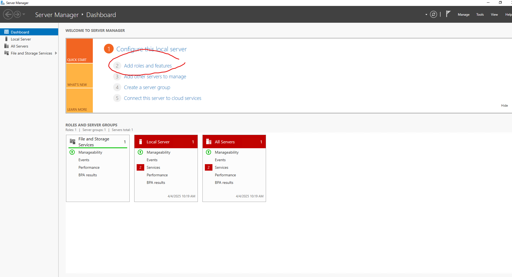
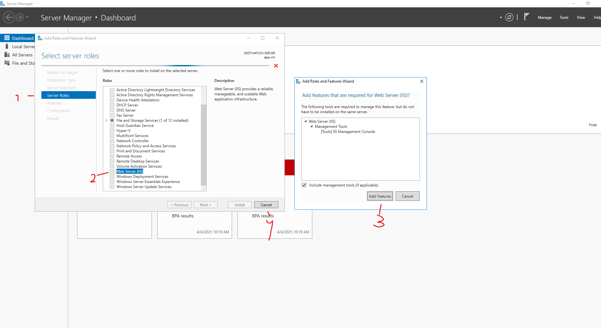

# Terraform - Azure - Part 18: Azure Infrastructure with Terraform - Lab- Custom Script extensions

In this project I am going to learn to use Terraform in Azure. The reason for learning Terraform over ARM templates (or Bicep) is that Terraform can be used on other cloud platforms such as AWS and Google Cloud. I am following along with the [Azure Infrastructure with Terraform](https://www.youtube.com/playlist?list=PLLc2nQDXYMHowSZ4Lkq2jnZ0gsJL3ArAw) playlist from Alan Rodrigues. Thanks Alan.

## Project Table of Contents

- [Part 1: Azure Infrastructure with Terraform - What and Why Terraform](Part-01-Azure-Infrastructure-With-Terraform-What-and-Why-Terraform.md)
- [Part 2: Azure Infrastructure with Terraform - Concepts when it comes to Terraform](Part-02-Azure-Infrastructure-with-Terraform-Concepts-when-it-comes-to-Terraform.md)
- [Part 3: Azure Infrastructure with Terraform - Terraform workflow](Part-03-Azure-Infrastructure-with-Terraform-Terraform-workflow.md)
- [Part 4: Azure Infrastructure with Terraform - Installing Terraform](Part-04-Azure-Infrastructure-with-Terraform-Installing-Terraform.md)
- [Part 5: Azure Infrastructure with Terraform - Creating a resource group](Part-05-Azure-Infrastructure-with-Terraform-Creating-a-resource-group.md)
- [Part 6: Azure Infrastructure with Terraform - Creating an Azure Storage Account](Part-06-Azure-Infrastructure-with-Terraform-Creating-an-Azure-Storage-Account.md)
- [Part 7: Azure Infrastructure with Terraform - Terraform state](Part-07-Azure-Infrastructure-with-Terraform-Terraform-state.md)
- [Part 8: Azure Infrastructure with Terraform - Creating a container and a blob](Part-08-Azure-Infrastructure-with-Terraform-Creating-a-container-and-a-blob.md)
- [Part 9: Azure Infrastructure with Terraform - Dependencies between resources](Part-09-Azure-Infrastructure-with-Terraform-Dependencies-between-resources.md)
- [Part 10: Azure Infrastructure with Terraform - Destroying the resources](Part-10-Azure-Infrastructure-with-Terraform-Destroying-the-resources.md)
- [Part 11: Azure Infrastructure with Terraform - Using Variables](Part-11-Azure-Infrastructure-with-Terraform-Using-Variables.md)
- [Part 12: Azure Infrastructure with Terraform - Lab - Creating an Azure virtual network](Part-12-Azure-Infrastructure-with-Terraform-Lab-Creating-an-Azure-virtual-network.md)
- [Part 13: Azure Infrastructure with Terraform - Lab - Creating an Azure virtual machine](Part-13-Azure-Infrastructure-with-Terraform-Lab-Creating-an-Azure-virtual-machine.md)
- [Part 14: Azure Infrastructure with Terraform - Quick note on accessing Azure resource properties](Part-14-Azure-Infrastructure-with-Terraform-Quick-note-on-accessing-Azure-resource-properties.md)
- [Part 15: Azure Infrastructure with Terraform - Lab - Create Public IP Address](Part-15-Azure-Infrastructure-with-Terraform-Lab-Create-Public-IP-Address.md)
- [Part 16: Azure Infrastructure with Terraform - Lab - Adding data disks](Part-16-Azure-Infrastructure-with-Terraform-Lab-Adding-data-disks.md)
- [Part 17: Azure Infrastructure with Terraform - Lab - Availability Sets](Part-17-Azure-Infrastructure-with-Terraform-Lab-Availability-Sets.md)
- [Part 18: Azure Infrastructure with Terraform - Lab- Custom Script extensions](Part-18-Azure-Infrastructure-with-Terraform-Lab-Custom-Script-extensions.md)

## Part 1 Table of Contents

- [Intro](#intro)
- [Result](#result)

# Project

<a id="intro"></a>

## Intro

In this video we're going to go into custom script extensions. These can be added to our vm to automatically run PowerShell or Bash scripts that will run during or after the creation of your vm. They can be used for things like installing software, configuring system settings, or deploying apps.

<a id="result"></a>

## Result

## [Part 18: Azure Infrastructure with Terraform - Lab- Custom Script extensions](https://www.youtube.com/watch?v=6IcC33D-qzA&list=PLLc2nQDXYMHowSZ4Lkq2jnZ0gsJL3ArAw&index=18)

Let's deploy our resources. Then go to your vm and look for the extensions & applications menu on the left side. As of writing this (03-2025), it's under settings. From here we can add extensions. We'll get back to this menu a little later.

We are going to add a custom script extension. As the name implies, with this extension you can create custom scripts. Let's say for instance you want to install internet information services, which is a web server rule, on a windows server 2019 machine. How you can do this without a custom script is as follows. First we'll log into our machine. Then when the server manager is loaded we click on "add roles and features":

  

Then we click on next until we get to the server roles menu (1), then we select "web server (IIS)" (2) and finally we click on "add features" (3). You can then cancel the process (4) since we're going to do the actual thing with a custom script:  

  

If we'd have gone through with the process, we'd have a web server running on our virtual machine. Since we're learning Terraform and that's all about automation, of course we're going to learn and do this automatically with a custom script. I mean what are we, *peasants*? The custom script extension runs a Powershell script that goes through the process so we don't have to log into our machine and do it manually. To run this script, we need to have a storage account where we'll be saving the script. Let's go ahead and add a storage account. In the basics menu add it to our existing resource group, give it a unique name, make sure it has the same location as the other resources and set redundancy to LRS. Leave everything else as is and create.  

Once the storage account is created we'll go into the resource and create a container. We need a blob container with anonymous access enabled and to do so we need to make an adjustment to our storage account resource settings. Since Alan's video things have changed and blob anonymous access is automatically set to disabled. To enable this we'll go to settings, configuration, and then set "Allow Blob anonymous access" to enable and then save. 

Now we can go to containers, add a new container, give it a name and set anonymous access level to "Blob" and create. From here we can go into our new container and upload a file. Alan uploads a script that you can download from his [Github repository](https://github.com/cloudxeus/terraform-azure/tree/main/18.%20Lab%20-%20Custom%20Script%20extensions). As did Alan, I've gone ahead and placed the file in my tmp directory. Now we can upload this file into our container.  

The file we've uploaded is a very simple Powershell script file:  

```
import-module servermanager
add-windowsfeature web-server -includeallsubfeature
add-windowsfeature Web-Asp-Net45
add-windowsfeature NET-Framework-Features 
```

It does the same thing as we did manually, only it does this with Powershell commands. We'll go ahead and run this script on our virtual machine. Let's go to our virtual machine and then 'Extensions & applications.' Now click on 'add' and add the custom script extension as we were in the process of doing at the start of this part. Let's add a script file by clicking on 'browse' and from here go to your storage account, then to your container, and from here you can choose your script file. Now let's not review & create like my *peasant* ass did before seeing the part of the video where Alan, again, aborts the process. Instead let's go to our storage account and delete it. After that it's time for the Terraform part! 

### Creating a custom script extension through Terraform  

Let's add a storage account resource block:  

```
resource "azurerm_storage_account" "appstore" {
  name                     = "appstore2984"
  resource_group_name      = local.resource_group
  location                 = local.location
  account_tier             = "Standard"
  account_replication_type = "LRS"
  allow_nested_items_to_be_public = true
}
```  

We've got the usual argument assignments, and then we have ```account_tier             = "Standard"```, ```account_replication_type = "LRS"``` and ```allow_blob_public_access = true```.  
&nbsp;

```account_tier             = "Standard"```  

We can leave this 'Standard'. This argument defines if we store our data on HDD (Standard) or SSD (Premium) disks.  
&nbsp;

```account_replication_type = "LRS"```  

Automatically set to GRS (Geo-Redundant Storage), we'll set it to LRS (Locally Redundant Storage). Locally redundant storage means that within 1 data centre your storage account is replicated 3 times. With Geo-redundant storage this happens in two regions. So now there's two data centres, each located in another region, that holds 3 copies of your storage account.  
&nbsp;

```allow_nested_items_to_be_public = true```  

This argument we add to our resource block to set the blob public access to enabled. Since Terraform version 3 and onward this is changed from ```allow_blob_public_access = true``` we see Alan use.  
&nbsp;

Now let's add our container resource:  

```
resource "azurerm_storage_container" "data" {
  name                  = "data"
  storage_account_id    = azurerm_storage_account.appstore.id
  container_access_type = "blob"
  depends_on = [ azurerm_storage_account.appstore ]
}
```


```storage_account_id    = azurerm_storage_account.appstore.id```  

In Alan's video ```storage_account_id``` is still ```storage_account_name```. This has been updated to make for a more robust and less error-prone config file. The old argument associated a plain string name to the container. For multiple reasons referencing the storage account id is more robust and less prone to error. I'll quickly list a few:

1. **Stronger Referencing:** By using a full resource reference (azurerm_storage_account.example.id), not just a name string, it helps Terraform understand dependencies more clearly and build the correct resource graph.
2. **Avoids Ambiguity:** Storage account names must be globally unique in Azure, but relying on names (especially hardcoded strings) can lead to bugs in larger or shared environments. IDs are guaranteed to be unique and fully qualified.
3. **Better for Resource Lifecycle:** When you use storage_account_id, Terraform knows to recreate or update dependent resources if the storage account changes — which it can’t safely do with just the name.
4. **Azure API Alignment:** Azure’s API increasingly favors resource IDs in place of names for referencing.  
&nbsp;

```container_access_type = "blob"```  

With this argument we can choose to set our access type to either private, blob or container.  

- **Private:** There is no anonymous access.  
- **Blob:** All blob files can be publicly read.  
- **Container:** All blob files and container metadata can be publicly read.  
&nbsp;

```depends_on = [ azurerm_storage_account.appstore ]```  

Finally we have our depends on meta argument. We're familiar with that by now. it makes sure that the container isn't deployed before the storage account. As you've read just before, the ```storage_account_id``` argument should make this redundant. But I'ma let it relax right there just to be sure. I don't want no beef with Alan.  

Now we have our storage blob resource:  


```
resource "azurerm_storage_blob" "IIS_Config" {
  name                   = "IIS_Config.ps1"
  storage_account_name   = "appstore2984"
  storage_container_name = "data"
  type                   = "Block"
  source                 = "IIS_Config.ps1"
  depends_on = [ azurerm_storage_container.data ]
}
```  

Just a quick recap for the storage account and container name arguments. We've been referencing names with the resource identifier ```resource_type.resource_name```. All of the sudden Alan decides to reference the resource names directly. I honestly forgot that was possible. After a little doing of the internet thing I found out it isn't best practice, so I actually am going to risk beef with Alan and say we use the resource identifier here too. This makes sure that Terraform knows the dependencies and if the names of the resources change you won't have any issues. So the new resource block: 

```
resource "azurerm_storage_blob" "IIS_Config" {
  name                   = "IIS_Config.ps1"
  storage_account_name   = azurerm_storage_account.appstore.name
  storage_container_name = azurerm_storage_container.data.name
  type                   = "Block"
  source                 = "IIS_Config.ps1"
  depends_on = [ azurerm_storage_container.data ]
}
```  

```type                   = "Block"```  

There are three types to be chosen from:  

1. **Block:**	Most common. Used for text, media, documents, backups — ideal for most file uploads (up to 190.7 TiB with premium accounts).
2. **Page:**	Optimized for frequent random read/write operations. Best for virtual hard disks (used by Azure VMs).
3. **Append:**	Optimized for append-only scenarios — e.g., logging, where data is added to the end of the file only.  
&nbsp;

```source                 = "IIS_Config.ps1"```  

Here we reference the Powershell script file we took from Alan's Github and placed into our tmp directory. This argument will import said file into the blob we're deploying. So it's important that we place the script file into the tmp directory.  
&nbsp;

Then finally we have our dependency (meta) argument, which we'll keep as a safety measure.  

Next up is the resource block that will install the virtual machine extension. This one has a lot of new info, so buckle up buckeroo:  

```
resource "azurerm_virtual_machine_extension" "vm_extension" {
  name                 = "appvm-extension"
  virtual_machine_id   = azurerm_windows_virtual_machine.app_vm.id
  publisher            = "Microsoft.Compute"
  type                 = "CustomScriptExtension"
  type_handler_version = "1.10"
  depends_on = [ azurerm_storage_blob.IIS_Config ]

  settings = <<SETTINGS
 {
 "fileUris": [https://${azurerm_storage_account.appstore.name}.blob.core.windows.net/data/IIS_Config.ps1"],
  "commandToExecute": "powershell -ExecutionPolicy Unrestricted -file IIS_Config.ps1"
 }
SETTINGS
}
```  


```publisher            = "Microsoft.Compute"```  

This setting tells Azure that the extension is published by Microsoft, under the Microsoft.Compute namespace. This way Azure knows where to look in the marketplace for the extension.  
&nbsp;

```type                 = "CustomScriptExtension"```  

And this one specifies further that Azure needs to look for the 'CustomscriptExtension.'  
&nbsp;  

```type_handler_version = "1.10"```  

This setting will tell what version of the extension Azure should install. With every update of an extension (or any kind of software) bugs can appear in its interaction with applications and infrastructure. To make sure things run *all smooth like* it is common practice to lock in software versions to avoid any unexpected issues and ensure consistent behaviour.  

Hold tight, here comes the big one:  

```
settings = <<SETTINGS
 {
 "fileUris": [https://${azurerm_storage_account.appstore.name}.blob.core.windows.net/data/IIS_Config.ps1"],
  "commandToExecute": "powershell -ExecutionPolicy Unrestricted -file IIS_Config.ps1"
 }
SETTINGS  
```  

Here we have an argument written with Heredoc syntax (<< SETTINGS...SETTINGS). This is used for defining multi-line strings, especially when the content might contain quotes, indentation, or JSON. The multi-line string in our argument is a JSON string. JSON (JavaScript Object Notation) is a lightweight way to structure data using:  

- Key-value pairs (like dictionaries)
- Arrays
- Strings, numbers, booleans, nulls  

Let's dive into our JSON strings:  

```"fileUris": ["https://${azurerm_storage_account.appstore.name}.blob.core.windows.net/data/IIS_Config.ps1"]```  

Our first string is a key value pair where the key is a string: ```"fileUris"``` and its value is an array with one string entry: ```"https://${azurerm_storage_account.appstore.name}.blob.core.windows.net/data/IIS_Config.ps1"```. This tells Azure where it can download the PowerShell script file by giving the url to the file.  ```${azurerm_storage_account.appstore.name}``` this part of the url is called interpolation (syntax: ```${}```). Think of it as a placeholder. When the code is run it will look up the actual storage account name and replace the placeholder with its real value.
&nbsp;

```"commandToExecute": "powershell -ExecutionPolicy Unrestricted -file IIS_Config.ps1"```  

Here we have another key value pair where the key is: ```"commandToExecute"``` and its value is a string: ```"powershell -ExecutionPolicy Unrestricted -file IIS_Config.ps1"```. This tells Azure to run the PowerShell script ```IIS_Config.ps1``` we've just asked it to download. The ```-ExecutionPolicy Unrestricted``` part allows the script to run without being blocked by local script execution policies.  
&nbsp;

LET'S DEPLOY OUR CONFIG FILE.  

Check the last two notes for a solution to potential errors.  After that you should have been able to successfully deploy your first custom script extension. CONGRATS. If not... hate to be you.  

Now, assuming all went well, enjoy your deployment and have a little look around Azure and your vm. When you're done go ahead and delete everything and enjoy a well deserved break.  

If you have any more errors try and take your time and thoroughly go through them. You got this. 


&nbsp;
&nbsp;

Notes:

- For some reason I cannot connect to the vm anymore. One thing I see is that there is no JIT access, but I need to have a specific plan for this, which I never had. This makes me think it can't be the culprit. The last thing I added was the availability set, so let's remove that part and see if it works.  
  
  That didn't do it. Another thing is that I added dependencies. Don't see how that could cause this issue but let's remove some. I decided with part 17 that I'd go through it first and then write up the markdown file. Because of this I added at least one dependency that I didn't document. I thought it would be oke, but now I realise that I'd really like to know exactly what I added so I can backtrack. Lesson learned.  

  Yeah no, The dependencies are staying. I'm getting deployment issues (who'd've thunk).  

  I think I know the issue. My IPv4 connection isn't working and connecting to a vm is over IPv4. Fuck.  
  
  I was able to fix the IPv4 issue. I don't exactly know how, but it's fixed. I tried everything and nothing was working. In the end it magically started working again. I know it has to do with my VPN but that's where it ends. *Ain't that a bridge and a half.*

- In part 16 I said that when looking for resource documentation in the Terraform registry, you need to add underscores instead of spaces to be able to find your resources. Now it finds everything if you use spaces, underscore, or even no spaces at all. I wonder if they changed something or if it was just *trippin'*.  

- The ```allow_blob_public_access``` argument was updated by Terraform. It's now  ```allow_nested_items_to_be_public```  

- I got an error for trying to reference the storage account id in the storage container resource block. This isn't yet supported in the Terraform version I'm using. Instead of updating my Terraform and being able to use ```storage_account_id = azurerm_storage_account.appstore.id```, I will use the old way: referencing the storage account name instead ```storage_account_name = azurerm_storage_account.appstore.name```. This way I avoid the risk of having to make a lot of adjustments to the Terraform config file. When starting a new config file I'll make sure to use the latest Terraform version. 

- The deployment gets stuck on creating the data disk attachment and the custom script extension. I'm going to try a dependency for the disk attachment on the custom script extension.  
  
  This fixed the data disk attachment creation but the extension is still stuck. It might be the fact that I chose such a slow size option in the vm setup. I'm going to try giving it a little more oomph. I'm going for size D2s v3 as in Alan's config file (each part has his current config file on his Github). This doubles my vCPUs and more than doubles my RAM memory when having size DS1 v2.  

  It took just 3 seconds shy of 30 minutes to create the virtual machine extension resource. I'm gonna try and find out why it took so long, because my trusted secret source tells me it should most definitely not take longer than 15 minutes with the D2s v3 size.  

  I tried to find out what exactly caused it to take so long by running various commands in the Azure CLI and spending way too long with my trusted secret source, but I am way too much of a noob and my time is better spent continuing with the course. The extension only needs to be used in one more part. That's manageable. Otherwise I'd have prioritised finding out and solving the cause for such a long deployment time.  

  When I had a look around my vm I found logs in the local server. I ran them through my trusted secret source and asked if it could tell me what they meant. One problem was insufficient DCOM permissions. I'm going to try one more deployment with an adjusted powershell script that should give the necessary permissions and see if that solves anything. If it does I'm still clueless but at least it will be solved and ain't that just nice.  

  Welp, that did nothing. That's my experimenting done. 


  