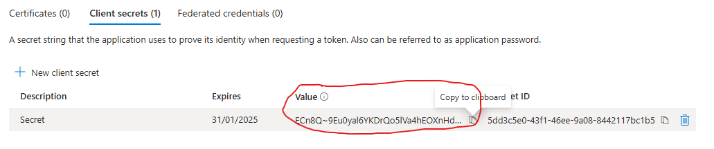

# [Terraform - Azure - Part 5: Azure Infrastructure with Terraform - Creating a resource group]
In this project I am going to learn to use Terraform in Azure. The reason for learning Terraform over ARM templates (or Bicep) is that Terraform can be used on other cloud platforms such as AWS and Google Cloud. I am following along with the [Azure Infrastructure with Terraform](https://www.youtube.com/playlist?list=PLLc2nQDXYMHowSZ4Lkq2jnZ0gsJL3ArAw) playlist from Alan Rodrigues. Thanks Alan.

## Project Table of Contents

- [Part 1: Azure Infrastructure with Terraform - What and Why Terraform](Part-1-Azure-Infrastructure-With-Terraform-What-and-Why-Terraform.md)
- [Part 2: Azure Infrastructure with Terraform - Concepts when it comes to Terraform](Part-2-Azure-Infrastructure-with-Terraform-Concepts-when-it-comes-to-Terraform.md)
- [Part 3: Azure Infrastructure with Terraform - Terraform workflow](Part-3-Azure-Infrastructure-with-Terraform-Terraform-workflow.md)
- [Part 4: Azure Infrastructure with Terraform - Installing Terraform](Part-4-Azure-Infrastructure-with-Terraform-Installing-Terraform.md)
- [Part 5: Azure Infrastructure with Terraform - Creating a resource group](Part-5-Azure-Infrastructure-with-Terraform-Creating-a-resource-group.md)

## Part 5 Table of Contents

- [Key-terms](#key-terms)
- [Used sources](#used-sources)
- [Result](#result)

## Project

<a id="key-terms"></a>

## Key-terms

**Terraform:**  Terraform is an opensource tool used for provisioning and managing cloud infrastructure. By using IaC (Infrastructure as Code) you can simplify the deployment of resources by automating the process instead of having to create all your resources by hand.

**IaC (Infrastructure as Code):** Infrastructure as Code (IaC) is the managing and provisioning of infrastructure through code instead of through manual processes.

**ARM templates:** ARM templates offer the same service as Terraform, the difference being it is native to Microsoft Azure. 

**Terraform configuration file:** This tells Terraform how to manage the infrastructure.

**Blocks:** These are used to represent the configuration of an object. They are found within the Terraform configuration file.

**Resource block:** This is a block used to represent the infrastructure you want to deploy. This will contain the resource type, the name, and the location. The resource type and the name become the resource identifier in the format of ```resource_type.resource_name```. The name and location are arguments within the resource block.

**Provider:** These allow Terraform to work with external providors like Azure, or AWS.

**Azure Active Directory (Now called Microsoft Entra ID):** The Azure Active Directory is your Multicloud identity and access management provider. Through it you can manage who has access to your apps and resources in the cloud. It can also be used to manage your on-premises environment. This is done by creating user identities.


<a id="used-sources"></a>

## Used sources

[1. The Azure Infrastructure with Terraform project of Alan Rodrigues](https://www.youtube.com/playlist?list=PLLc2nQDXYMHowSZ4Lkq2jnZ0gsJL3ArAw)

[2. How to create a table of contents](https://stackoverflow.com/questions/11948245/markdown-to-create-pages-and-table-of-contents)

[3. What is Azure Active Directory (Now called Microsoft Entra ID)?](https://www.microsoft.com/en-us/security/business/identity-access/microsoft-entra-id)

[4. What is IaC (Infrastructure as Code)?](https://redhat.com/en/topics/automation/what-is-infrastructure-as-code-iac)

<a id="result"></a>

# Result

Note: In the images below you'll find certain parts blacked out. It is highly advisable to keep personal information like your account details to yourself. Only when it is necessary should you share such personal information with those that require it. This is a good practice comparable to the [Principle of Least Privilege (PoLP)](https://learn.microsoft.com/en-us/entra/identity-platform/secure-least-privileged-access). An exception was made with the client secret image, since I'll delete this afterwards, removing any potential security risk.


## [Part 5: Azure Infrastructure with Terraform - Creating a resource group](https://www.youtube.com/watch?v=wB52Rd5N9IQ&list=PLLc2nQDXYMHowSZ4Lkq2jnZ0gsJL3ArAw&index=5)


In this video, Alan will show the process of deploying a resource group through the Azure Portal, and afterwards he is going to show the process through Terraform. I will follow along and add printscreens of the process. 

To create resources, you need a subscription and a resource group. The subscription is for billing purposes, and the resource group is for a logical grouping of the resources. There are four levels to management that are, from high to low:

- Management groups
- Subscriptions
- Resource groups
- Resources

### **Creating a resource group in the Azure Portal:**

1. Click on the create button of the Resource group's sub menu.  
    
2. Choose your subscription, name your resource group, and choose a region. Then skip the Tags menu by clicking on Review + create.
    
3. Create your resource group.  
    
4. Congrats! Now delete your resource group. This is done by clicking on the resource group menu on the left hand side as is seen in step 1.   
      
    
   
After this you click on 'delete resource,' as is seen in the first circle. Then you fill in the resource name and click on the delete button, as is seen in the second circle. After this a confirmation window will pop up where you click on delete again.

### **Creating a resource group in Terraform:**

1. Go to the [Terraform documentation for the Azure Provider](https://registry.terraform.io/providers/hashicorp/azurerm/latest/docs) where you will find all the necessary statements - in the Terraform language - needed to work with a particular service on Azure. For other platforms like AWS, there is a similar documentation to provide the necessary statements to work within the respective provider.
     - It is important to be aware of the provider version you are using, in this case the Azure provider. A lot of updates happen within Azure, so the provider is constantly updated to accommodate these changes and additions to Azure.
  
2. The first important step in the definition of our first configuration file is authentication. Terraform needs the right credentials to get the same privileges for creating resources as your Azure account has. This should be done without giving all your Azure account details to Terraform, since that would increase the chance of a security breach. A separate set of credentials needs to be created for Terraform so that it can be authenticated and get the necessary privileges on the Azure platform. For this, we will create an Application Object in Azure Active Directory. It is similar to a user identity in that it creates a digital identity within Microsoft Entra ID. 

    **Creating an Application Object:**

    1. Go to the "Microsoft Entra ID" menu item and click on it.  
    
    2. Open the "Manage" (1) option and click on "App registration" (2).  
    
    3. Click on "New registration."  
    
    4. Create a display name. Leave the rest as it is, and click on register.  
      
    An identity has now been defined which can be used by our Terraform configuration file.

3. **Creating a resource group with Terraform**  
    1. we go back to the [Terraform documentation for the Azure Provider, or azurerm modules.](https://registry.terraform.io/providers/hashicorp/azurerm/latest/docs). Here you can click on the provider button, and then copy the code that appears:  
    

    2. Now we paste the code into the Terraform configuration file (main.tf) we've created before in [part 4](Part-4-Azure-Infrastructure-with-Terraform-Installing-Terraform.md). This is the starting point for using the Azure Resource Manager (azurerm) provider by Terraform.  
    
        1. The first block tells Terraform that we need the azurerm provider so that our code can be used to create resources on the Azure platform: 
        ```
        terraform {
            required_providers {
                azurerm = {
                    source = "hashicorp/azurerm"
                    version = "3.113.0"
                }
            }
        }
        ```
        2. The second block is where we give the configuration options. The credentials for authentication go here. This is where you'll add your subscription ID, client ID, client secret, tenant ID, and features. It will look like so:
        ```
        provider "azurerm" {
            subscription_id   = ""
            client_id         = ""
            client_secret     = ""
            tenant_id         = ""
            features {}
        }
        ```
        **Client ID:**  

        To find your client id, you go to your azure portal and type terraform into the search bar. After you've done this you click on your previously created terraform application:  
        

        Here you'll find your application (client) ID. Hover over it and click on copy to clipboard to copy the ID.  
        
        
        Next, place it into your client_id argument in your provider block.  
        

        **Tenant ID:**

        Two spots below your client ID, you'll find your directory (tenant) ID. Copy and paste this ID just as you did with the client ID. 

        **Client secret:**

        Still on the application (terraform) page, you'll find the option to add a certificate or secret. Click on it:  
        

        This will take you to the certificates & secrets menu. Here you can create a new client secret (1), name it what you want, I went with the video and called it "Secret" (2), and add it (3):  
        

        After this is done, you'll see your new client secret. Copy the value and place it into the client secret string in your Terraform config file (main.tf). Once you leave this page and come back, this value will be permenantly hidden, so be sure to copy it right away.  
         

        **Subscription ID:**

        Type 'subscriptions' into your search bar (1) in the portal, and click on subscriptions (2):  
        

        From there you can click on your subscription:  
        

        And here you can copy the subscription ID to the clipboard.  
        


        Now you have your provider, and authentication details sorted in your Terraform file.


    3. Setting permissions for the application object. 
        Through the use of RBAC(Role Based Access Control) we will give the role of contributor to the application object. This will ensure that the application object has the right permissions to create resources within the Azure subscription. 

        1. On your subscription page, you can click on Access control (IAM) on the left menu:  
        

        From there you can click on add, and add role assignment.  
        


        Now you select Priviliged administrator roles (1), then Contributor (2), and then next (3).  
        


        From here you make sure that 'User, group, or service principal' is selected (1), you click on 'select members' (2), you type the application name into the searchbar (3), then select the application (4-5), and then click on review + assign (6). Click on the review + assign button twice.  
        


    Now, the application object (terraform) has the necessary permissions to add and manage resources within the subscription. 

    4. Creating a resource block for the resource group in the Terraform file

        If you go back to [part 2](#part2), you'll find the structure of the resource block we're going to create now:

        ```
        resource "azurerm_resource_group" "app_grp"{
            name="app-grp"
            location="North Europe"
        }
        ```
        The resource block is used to represent the infrastructure you want to deploy. It will contain the resource type ```"azurerm_resource_group"```and name ```"app-grp"```.

        The resource type and name will become the resource identifier in the form of ```resource_type.resource_name```. 

        The name ```name="app-grp"``` and location ```location="North Europe"``` are arguments within the resource block. This is to ensure the right property values are in place when defining the resource. You decide these arguments depending on the resource needs.

        There's a difference in the upper ```"app_grp"```, and ```name = "app-grp"```. the first is used as an identifier for the resource within the configuration file, and the second is used as an identifier for the resource group that will be created with the aforementioned resource. When we need to refer to the resource elsewhere in the configuration file, we can use ```resource_type.resource_name``` to do so.

    5. Deploying the Terraform file

        Now that we have our complete Terraform file, we can start the deployment process. Below you'll see what your file should look like, with the provider block being filled with your own information.
        
          

        1. Create a new terminal:  

         

        2. Initialise the working directory by using the ```terraform init``` command: 

          

        The azurerm provider is now installed as you can see from the information below the ```terraform init``` command. 

        3. Use the ```terraform plan```(1) command so that Terraform will create a plan based on the configuration file. Use the ```-out```(2) parameter to create the name ```main.tfplan```(3) for the plan file you're going to create.  

         


        You can see after running the command that a plan has been created (4), as well as a plan file (5). Now, to deploy the resources we've set out to deploy, we only have to use the ```terraform apply "main.tfplan"```(6) command.  

          

        You can see that the deployment was a success! You can now go to your Azure Portal and to your resource groups where you should find your new 'app-grp' resource group created. If it's not yet there, give it a minute, it will still be deploying.  

         


